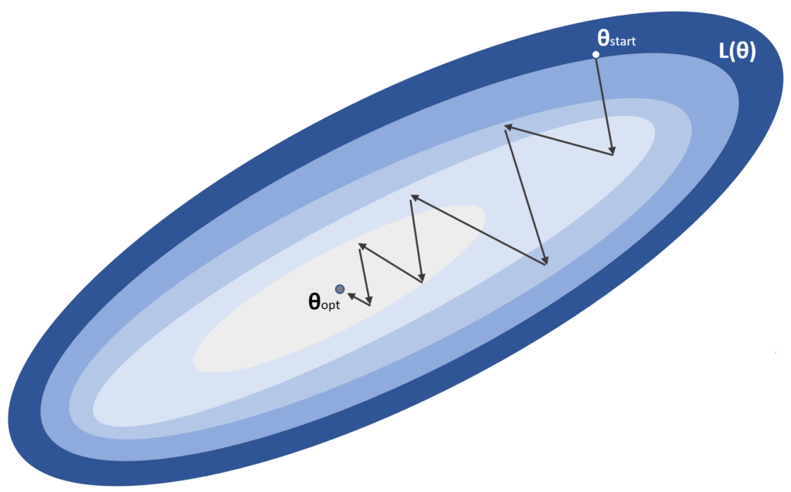
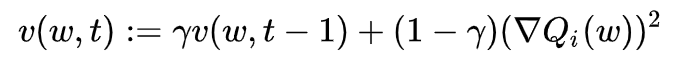
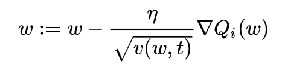
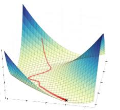

# ML 스터디 12주차 : Bayesian Network, Cross Validation, Gradient Descent Optimization

## **남궁선**
## Gradient Descent Optimization for Neural Network

###### Gradient Descent Optimization Algorithms at Long Valley

- Gradient Descent Optimization 이란 신경망 학습에서 손실함수의 값을 가능한 한 낮추는 매개변수의 최적값을 찾는 문제를 푸는 것을 지칭한다.
- 참고 : [6주차 : Gradient Descent Alogrithm](../6주차)

## 종류
- Stochastic Gradient Descent(SGD)
- Momentum
- AdaGrad
- RMSprop
- Adam
- etc

## 1. Stochastic Gradient Descent(SGD)

-

### 특징
- Mini-batch 데이터를 사용한다.
- 기울어진 방향으로 탐색한다.
- 구현이 쉽다.

### 단점
- 지그재그로 이동하여 비효율 적이다.
- 비등방성 함수 탐색경로가 비효율적이다.
  
## 2. Momentum

### 특징
- △w는 속도의 역할을 한다.
- △w는 초기에 0으로 설정한다.
- ⍶△w 는 물체가 아무런 힘을 받지 않을 때 서서히 하강시키는 역할을 한다.
- ⍶는 저항의 역할로 0.4, 0.9 등의 값으로 설정한다.
- SGD와 비교하여 지그재그의 정도가 덜하다.
- 학습이 반복될수록 한 방향으로 가속도가 붙는다.

- local minima를 빠져나오는 효과를 기대할 수 있다.

### 단점
- 기존의 변수들 외에도 과거에 이동했던 양을 변수별로 저장해야하므로 변수에 대한 메모리가 기존의 두 배로 필요하게 된다
  
## 3. AdaGrad

-

### 특징
- 학습을 진행하면서 학습률을 점차 줄여가는 학습률 감소(Learning rate decay)기법을 사용한다.
- 처음에는 크게 학습하다가 조금씩 작게 학습한다.
- 매개변수에 적응적으로(adaptive) 학습률을 조정하며 학습한다.
  
### 단점
- 과거의 기울기를 제곱하여 계속 더해가는 특성으로 인하여, 학습이 반복되면 학습률이 0에 가까워져서 학습이 진행되지 않는다.
  
## 4. RMSProp

### 특징
- AdaGrad의 단점을 개선한 알고리즘
- 과거의 기울기는 반영률을 줄이고 새로운 기울기를 크게 반영한다.
- 지수이동평균(Exponential Moving EMA)

## 5. Adam

### 특징
- Momentum + RMSProp = Adam
- Momentum 방식과 유사하게 지금까지 계산해온 기울기의 지수평균을 저장한다.
- RMSProp과 유사하게 기울기의 제곱값의 지수평균을 저장한다.
- m과 v가 처음에 0으로 초기화되어 있기 때문에 학습의 초반부에서는 m,v가 0에 가깝게 bias 되어있을 것이라고 판단하여 이를 unbiased 하게 만들어주는 작업을 거친다.
- 하이퍼 파라미터의 편향이 보정된다.
- 보통 β1 로는 0.9, β2로는 0.999, ϵ 으로는 10−8 정도의 값을 사용한다.

## 6. etc
- Nesterov Accelerated Gradient (NAG)
- AdaDelta
- Natural Gradient Descent and kSGD

