# ML 스터디 13주차 : Dropout, Cross Validation, Gradient Descent Optimization

## **조민지**

참조 논문: [A simple Way to Prevent Neural Networks from Overfitting](https://www.cs.toronto.edu/~hinton/absps/JMLRdropout.pdf)

1. #### 머신 러닝에서 학습을 시킬때 문제 중 하나는 Overfitting이다. 

   - Overfitting이란 통계나 기계 학습에서 사용되는 용어로서, 제한된 샘플(혹은 훈련에 사용한 한정된 데이터)에 너무 특화가 되어, 새로운 샘플에 대한 예측의 결과가 오히려 나빠지거나 학습의 효과가 나타나지 않은 경우를 말한다. 우리말로는 *과적합* 이라는 용어로 번역이 된다.  

     

   - (a)는 오류가 많아보인다. (c)는 모든 점들을 그래도 살려 오차가 없이 추정을 하는 경우이다. 이 경우 주어진 샘플(훈련 데이터)에 대해서는 최적의 결과를 나타낼 수 있지만, 새로운 샘플이 주어지는 경우는 엉터리 결과가 나올 수도 있다. (b)는 비록 약간의 오차는 있지만 새로운 샘플들이 들어올 때는 좋은 결과가 나올 수도 있다. 

2. #### overfitting을 해결하는 방법은?

   - 정답은 없다. (c)가 올바른 추정일 수도 있고, (b)가 올바른 추정일 수도 있다. 결과적으로는 샘플의 수를 늘리거나 훈련 데이터의 양을 늘리는 것이 정답일 것이다. 하지만 데이터의 양을 늘리는 것은 결과적으로 많은 비용과 노력이 필요하기 때문에, 여러가지 대안의 방법들이 제시되고 있다.

   - 위 그림처럼 (b)와 (c) 중 어느것을 택할 것인가 선택의 상황이 있을 때 흔히 적용되는 방법이 *Occam's Razor* 오캄의 면도날 방법이다. 

     > 14세기 영국의 신학자이자 논리학자인 오캄의 저서에 등장하며, 중세의 철학자와 신학자들이 복잡한 논쟁을 배제시키자는 뜻에서, 설명이 더 복잡한 이론을 배제할 때 흔히 사용이 된다. 물론 항상 진리는 아니지만, 필연성 없는 개념을 배제하려고 한 *사고의 절약의 원리*  라고도 불리며, 같은 현상을 설명하는 두 개의 주장이 있다면 간단한 쪽을 선택하라고 한다. 오캄의 원리에 의해서 주어진 점들을 추정한다면 당연히 (b)를 선택하는 것이 맞다. 

3. #### Overfitting 해결을 위한 Regularization(일반화) 방식

   - 통상적으로 기계학습이나 통계적 추론을 할 때 cost function 혹은 error function이 작아지는 쪽으로 진행을 하게 된다. 단순하게 작아지는 쪽으로만 진행을 하다 보면, 특정 가중치 값들이 커지면서 오히려 결과를 나쁘게 하는 경우도 있다. 아래 그림은 regularization을 통해 더 좋은 학습 결과를 가져오는 경우를 보여주는 그림이다.

     

   - Regularization에 대한 설명은 여기까지 overfitting 문제를 해결하는 방법 중 확실한 대책은 훈련 데이터의 양을 늘리는 것이다. 하지만, 훈련 데이터는 아무런 대가 없이 그냥 얻어지는 것이 아니다. 양질의 훈련 데이터를 얻으려면 많은 시간과 비용이 필요하며, 어떤 경우는 추가 데이터의 확보가 어렵거나 불가능한 경우도 있다. 그래서 제한된 훈련 데이터만으로 최적의 결과를 도출하기 위한 방법으로 Regularization이 있는것이다.

4. #### Overfitting 해결을 위한 지능적 훈련 데이터 만들기

   - ##### Affine Transform을 이용한 지능적 훈련 데이터 생성

     

     오른쪽 데이터는 왼쪽 데이터를 반시계 방향으로 15도 회전하여 얻은 데이터이다. affine transform은 아리와 같은 4가지 연산을 할 수 있으며 이것들을 조합하면 많은 훈련 데이터를 확보할 수 있다.

     

   - ##### Elastic Distortion을 이용한 지능적 훈련 데이터 생성

     마이크로 소프트에서 효과적인 훈련 데이터 생성을 위해 *elastic distortion* 이라는 방법을 개발하였고 특허 출원을 하였다. affine transform과 같은 단순한 변형이 아니라, 아래 그림처럼 다양한 방향으로의 displacement vector을 만들어 내고 그것을 통해 좀 더 복잡한 형태의 데이터를 만들어 낼 수 있게 되었다.

     

5. ####  신경망에서 Overfitting 해결을 위한 dropout 방식 

   - Dropout은 아래의 그림(a)에 대한 학습을 할 때, 망에 있는 모든 layer에 대해 학습을 수행하는 것이 아니라 그림 (b)와 같이 망에 있는 input layer나 hidden layer의 일부 뉴런을 생략하고 줄어든 신경망을 통해 학습을 수행한다. 일정한 mini-batch 구간 동안 생략된 망에 대한 학습을 끝내면, 다시 무작위로 다른 뉴런들을 생략하면서 반복적으로 학습을 수행한다.

     

6. ####  Dropout 의 효과

   - **Voting 효과**: 일정한 mini-batch 구간 동안 줄어든 망을 이용해 학습을 하게 되면, 그 망은 그 망 나름대로 overfitting이 되며, 다른 mini-batch 구간 동안 다른 망에 대해 학습을 하게 되면, 그망에 대해 다시 일정 정도 overfitting이 된다. 이런 과정을 무작위로 반복을 하게 되면, voting에 의해 평균 효과를 얻을 수 있기 때문에, 결과적으로 regularization과 비슷한 효과를 얻을 수 있데 되는 것이다.

   - **co-adaptation을 피하는 효과**: Regularization에서 살펴본 것처럼, 특정 뉴런의 바이어스나 가중치가 큰 값을 갖게 되면 그것의 영향이 커지면서 다른 뉴런들의 학습 속도가 느려지거나 학습이 제대로 진행이 되지 못하는 경우가 있다. 하지만 dropout을 하면서 학습을 하게 되면, 결과적으로 어떤 뉴런의 가중치나 바이어스가 특정 뉴런의 영향을 받지 않기 때문에 결과적으로 뉴런들이 서로 동조화(co-adaptation)이 되는 것을 피할 수 있다.

     이로써 좀 더 선명한 feature을 얻을 수 있다.

     

   - 또한 dropout을 하게 되면, hidden 뉴런들의 활성도가 좀 더 드문드문 해지는 경향이 생긴다. 아래 그림에서 왼쪽 그림은 dropout이 없는 일반 신경망에서 hidden layer의 활성도를 보여주고 있는데 히스토 그램이 좀 더 넓게 퍼져 있는 것을 확인 할 수 있므녀, 오른쪽은 0.5 확률로 dropout을 실행하였을 때 히스토그램이 좀 더 집중되는 것을 알 수 있다. 의도하지 않았지만, 좋은 성질을 얻게 된 것이다.

      

   - 특정 학습 데이터나 자료에 영향을 받지 않는 보다 강건한 망을 구성할 수가 있게 되는것이다.

7. #### CNN의 핵심 요소 기술 Dropout

   - 모델 결합을 하게 되면 학습의 성능을 개선 할 수 있다. 모델 결합의 효과를 얻으려면, 서로 다른 학습 데이터를 이용해서 학습을 하거나, 모델이 서로 다른 구조를 가져야 한다. 하지만, 망이 깊은 경우 1개의 망을 학습시키는 것도 만만치 않은데, 복수개의 망을 학습시키는 것은 매우 힘든 작업이 된다. 또한 어떻게 해서 다양한 모델을 학습시켰을지라도 다양한 모델을 실행시킬 때 시간을 작아먹기 때문에 빠른 response time이 요구되는 경우에 곤란하다.

     Dropout은 위 2 가지 문제를 해결하기 위해 개발된 것이다. 

     여러개의 모델을 만드는 대신에 모델 결합에 의한 투표 효과와 비슷한 효과를 내기 위해 학습 사이클이 진행되는 동안 무작위로 일부 뉴런을 생략한다. 그렇게 되면 생략되는 뉴런의 조합만큼 지수함수적으로 다양한 모델을 학습시키는 것이나 마찬가지 이기 때문에 모델 결합의 효과를 누릴 수 있다.

     또한 실제로 실행 시킬 때는 생략된 많은 모델을 따로 실행시키는 것이 아니라, 생략된 모델들이 모두 파라미터를 공유하고 있기 때문에 모두 각각의 뉴런들이 존속할 (dropout 하지 않을) 확률을 각각의 가중치에 곱해주는 형태가 된다. 

   - 그림으로 표현하면 아래와 같다. 학습시에는 뉴런은 존속할 확률 p로 학습을 진행하고, 실행할 때는 각각의 넷에 얻어진 가중치에 존속할 확률 p를 곱해준다.

     

8. #### Dropout 모델링

   

   -  Standard: 

     

   - Dropout:  

     

   - 베르눌리 랜덤 변수인 r을 곱해준다.  이는 유닛의 존재 유/무 두가지 값을 갖는 랜덤 변수이다. 유닛이 존재할 확률이 p라고 하면 평균은 p이고, 분산은 p(1-p)인 변수를 말한다.

## **정초이**

# Week 12 : Bayesian Network, Cross Validation, Gradient Descent Optimization

# Cross Validation 교차 검증

## 요약

- 기계학습 모델은 학습하기 위해서 데이터셋을 필요로 한다.
- 데이터셋은 모델을 학습시키기 위해서 사용하기도 하지만, 모델의 성능을 평가하는데 사용된다.
- 학습과 성능 평가를 위해서 training, testing dataset으로 구분한다.
- 학습과정에서 여러 모델이 생겨난다. (파라미터 튜닝을 하는 이유)
- 이들 모델을 선택할 때, 모델의 bias, variance를 측정하는 것은 중요한 과정이다.
- cross-validation dataset은 모델의 bias, variance를 측정하는 기준으로도 사용한다.

- 우리가 만든 모델의 적합성을 보다 객관적으로 평가하기 위한 방법중의 하나
- 충분한 데이터가 확보되지 않은 상황에서 데이터 분석을 수행할 경우 통계적 신뢰도를 높이기 위하여 사용되는 방법

## 교차 검증?

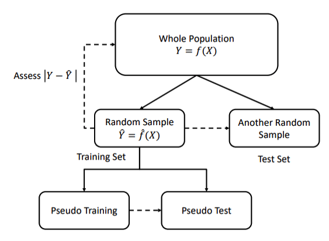

- Whole population(모집단)에서 Y와 f를 구하기 위해

  Training Set(모집단에서 나온 데이터셋)에서 f와 똑같지 않지만 비슷한 모델 f^를 만듦

- 이 모델을 모집단에서 나온 또 다른 데이터 셋인 Test Set을 이용하여 확인

  (일반적으로 Test Set이 별도로 존재하는 경우가 많지 않기 때문에 Training Set을 2개의 데이터셋으로 나눔)

- Training Set과 Test Set을 어떻게 나누느냐에 따라 모델의 성능이 달라질 수 있다.

- 이런 테스트 방법을 **교차 검증**이라고 함

## LpOCV (leave-p-out cross validation) 

- 가능한 경우의 수 만큼 모두 반복
- n : 전체샘플 수
- P : 가능한 Validation Set의 데이터 수
- 따라서 n이 커지면 연산이 복잡해짐

## LOOCV (leave-one-out cross validation) 

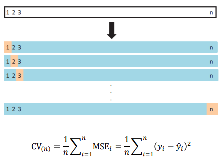

- N 개의 데이터 샘플에서 한 개의 데이터 샘플을 test set 으로 하고,

  1개를 뺀 나머지 n-1 개를 training set으로 두고 모델을 검증

- 전체 샘플 수 n 만큼 반복

- Leave-p-out CV의 p=1인 특수한 경우

- k-fold CV의 k=n(폴드의 수 = 전체 샘플 수)인 경우도 동일

- 계산의 어려움은 없음

- 에러 평가

  - 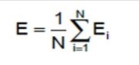

- 작은 데이터셋에 유용 (n번 반복해야 해서 계산비용 많이 필요)

- test set이 하나의 샘플만 담고 있어서 분산이 큼

- 하나의 관측치에 기반 —> 번동이 심함

## Holdout Cross Validation

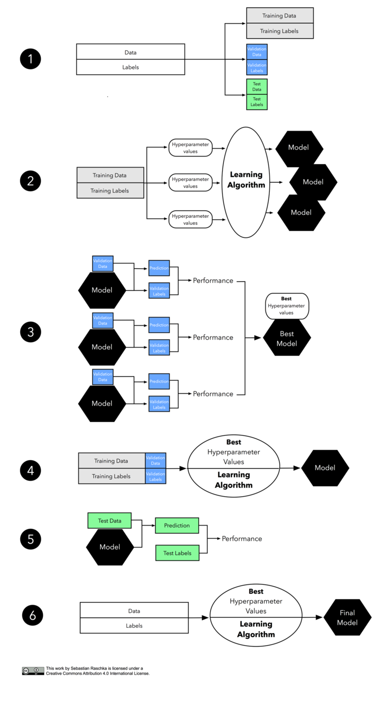

 Hold Out Method : Training Set으로 훈련하고 빼놓았던 Validation Set으로 검증하는 기본 기법

   \- subset을 Resampling 하는 방법에 따라 다양한 기법이 존재함

- 데이터를 Training Set과 Validation Set으로 분리 
- Training Set으로 학습 
- Validation Set으로 검증
- ①~③반복 수행 후 , 오류의 평균으로 평가

### 장점

- 데이터 셋이 충분히 클 경우 계산의 효율성이 좋음

- 3방향 홀드아웃은 k-fold CV 보다 연산 비용이 저렴 —> 선호됨

- 연산의 효율성을 제외하고 비교적 큰 샘플 크기를 가지고 있을 때 딥러닝 알고리즘을 사용한다면,

  데이터셋을 훈련, 검증, 테스트용으로 어떻게 분할하느냐에 따라 추정이 민감해지는 분산에 대해 걱정할 필요가 없다

- 비교적 샘플 사이즈가 클때 모델 평가로 아주 적당 

- 모델 선택에서는 연산 비용의 제약 때문에 3방향 홀드아웃 방식 채택

- 모델 평가시 레이블된 데이터를 새로 구하기 어려운 현실적인 제약을 해결하려고 사용

## KFCV (K-fold CV)

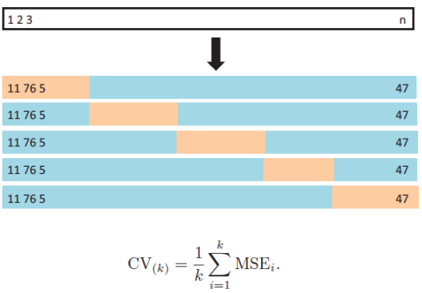

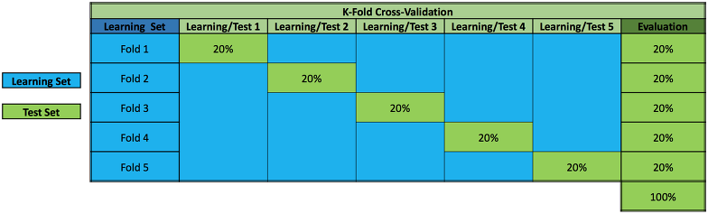

- n개의 데이터를 랜덤하게 섞어 균등하게 k개의 그룹(subset)으로 나눔
- 한 개의 그룹이 test set이고 나머지 k-1 개의 그룹들이 training set이 되어 k번을 반복함
- LOOCV도 n-fold CV로 볼 수 있음
- 가장 널리 쓰임
- 균일하게 분할한 K가 반드시 한번씩은 validation set(=test set) 또는 training set 으로 쓰임
- k-fold CV는 Hold Out Method과 Leave-One-Out CV 기법의 중도적 기법
- 오류 평가
  - 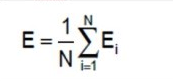

### k（파라미터）가 작을 경우

- k가 너무 작으면 추정값의 비관적 편향이 증가되고(모델 학습에 더 적은 훈련 데이터가 사용되기 때문에), 

  데이터를 어떻게 분할하느냐에 모델이 더 민감해지기 때문에 추정의 분산도 증가될 것

## RLT (Repeated Learning-Testing )

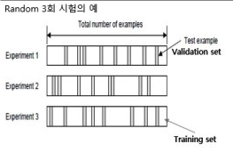

Random 3회 시험의 예시

- random 하게 training set, validation set 을 분리함
- validation set을 빼놓고 나머지를 training set으로 훈련
- validation set으로 Error Ei 계산
- 차례대로 2,3번 과정을 2회 더 반복
- 평균 오류를 계산
  - 에러 평가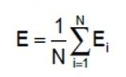

- 이때, 각 subset은 균일할 수록 좋음

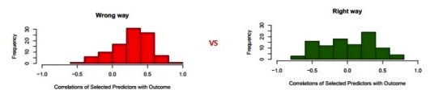

### Monte-Carlo CV

- RLT에서 Random 복원 추출(중복 허용)인 경우가 Monte-Carlo CV

## 정리

- LpOCV, LOOCV 를 묶어서 Exhausive CV로 분류함
- KFCV, RLT는 Non-exhausive CV로 분류함
  - Non-Exhaustive CV는 Random 부분 추출기법이며 Exhausive-CV의 근사치임

***

## **남궁선**
## Gradient Descent Optimization for Neural Network

###### Gradient Descent Optimization Algorithms at Long Valley

- Gradient Descent Optimization 이란 신경망 학습에서 손실함수의 값을 가능한 한 낮추는 매개변수의 최적값을 찾는 문제를 푸는 것을 지칭한다.
- 참고 : [6주차 : Gradient Descent Alogrithm](../6주차)

## 종류
- Stochastic Gradient Descent(SGD)
- Momentum
- AdaGrad
- RMSprop
- Adam
- etc

## 1. Stochastic Gradient Descent(SGD)

-
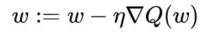

### 특징
- Mini-batch 데이터를 사용한다.
- 기울어진 방향으로 탐색한다.
- 구현이 쉽다.

### 단점
- 지그재그로 이동하여 비효율 적이다.
- 비등방성 함수 탐색경로가 비효율적이다.
  
## 2. Momentum

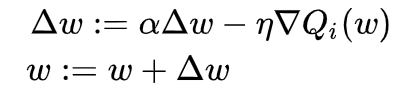

### 특징
- △w는 속도의 역할을 한다.
- △w는 초기에 0으로 설정한다.
- ⍶△w 는 물체가 아무런 힘을 받지 않을 때 서서히 하강시키는 역할을 한다.
- ⍶는 저항의 역할로 0.4, 0.9 등의 값으로 설정한다.
- SGD와 비교하여 지그재그의 정도가 덜하다.
- 학습이 반복될수록 한 방향으로 가속도가 붙는다.

- local minima를 빠져나오는 효과를 기대할 수 있다.

### 단점
- 기존의 변수들 외에도 과거에 이동했던 양을 변수별로 저장해야하므로 변수에 대한 메모리가 기존의 두 배로 필요하게 된다
  
## 3. AdaGrad
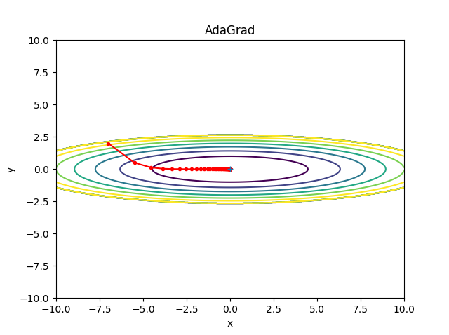
-
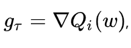
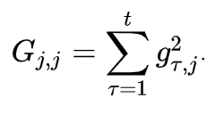
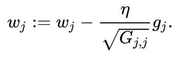

### 특징
- 학습을 진행하면서 학습률을 점차 줄여가는 학습률 감소(Learning rate decay)기법을 사용한다.
- 처음에는 크게 학습하다가 조금씩 작게 학습한다.
- 매개변수에 적응적으로(adaptive) 학습률을 조정하며 학습한다.
  
### 단점
- 과거의 기울기를 제곱하여 계속 더해가는 특성으로 인하여, 학습이 반복되면 학습률이 0에 가까워져서 학습이 진행되지 않는다.
  
## 4. RMSProp

### 특징
- AdaGrad의 단점을 개선한 알고리즘
- 과거의 기울기는 반영률을 줄이고 새로운 기울기를 크게 반영한다.
- 지수이동평균(Exponential Moving EMA)

## 5. Adam

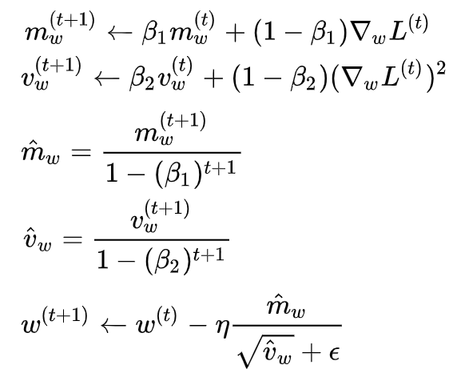

### 특징
- Momentum + RMSProp = Adam
- Momentum 방식과 유사하게 지금까지 계산해온 기울기의 지수평균을 저장한다.
- RMSProp과 유사하게 기울기의 제곱값의 지수평균을 저장한다.
- m과 v가 처음에 0으로 초기화되어 있기 때문에 학습의 초반부에서는 m,v가 0에 가깝게 bias 되어있을 것이라고 판단하여 이를 unbiased 하게 만들어주는 작업을 거친다.
- 하이퍼 파라미터의 편향이 보정된다.
- 보통 β1 로는 0.9, β2로는 0.999, ϵ 으로는 10−8 정도의 값을 사용한다.

## 6. etc
- Nesterov Accelerated Gradient (NAG)
- AdaDelta
- Natural Gradient Descent and kSGD

***
