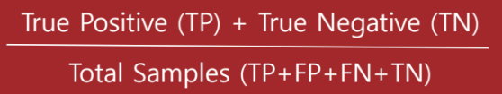
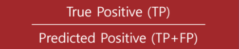
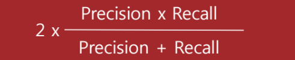
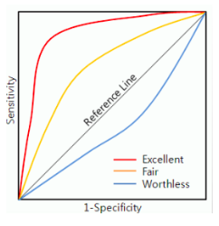

ML 스터디 14주차 : Confusion Matrix / Standardization, Normalization, Regularization / Data Preprocessing
=======================================================================================================

조민지
--------
- Standardization 표준화
- Normalization 정규화
  - Batch Normalization
- Regularization
  - L1 Regularization
  - L2 Regularization

1. Standardization 표준화

   - 수식: (요소값 - 평균) / 표준편차

   - 평균을 기준으로 얼마나 떨어져 있는지를 나타내는 값

   - 이 방법을 적용하려면 2개 이상의 대상이 단위가 다를 때 대상 데이터를 같은 기준으로 볼 수 있게 한다. 

   - > 예를 들어, S사와 H사의 주식시세에 대해 동일 기간에 대해 표준화를 수행하면 두 종목이 어떤 특징을 가지고 움직이는 지 관찰하는데 도움이 된다. 

   - > 예를 들어, 몸무게와 키에 대해 표준화를 수행한 후 데이터를 보았을 때 몸무게는 음수, 키는 양수 값이 나온다면 그사람은 평균보다 키가크고 몸이 마른 편이라 할 수 있다.

   - 표준화는 데이터를 다소 평평하게 하는 특성을 가진다. 간극이 줄어드는 효과가 발생하여 고객별 매출금액과 같이 간극이 큰 데이터의 간극을 줄이는 결과를 얻게 된다. 그 결과 분석 대상 고객군을 정하는 데 약간의 편의성을 제공한다.

     

2. Normalization 정규화

   - 수식: (요소값 - 최소값) / (최대값 - 최소값)
   - 정규화는 전체 구간을 0~100으로 설정하여 데이터를 관찰하는 방법이다.
   - 이 방법은 데이터 군 내에서 특정 데이터가 가지는 위치를 볼 때 사용된다.
   - 시세와 같이 주기를 띄는 데이터의 경우 과거 대비 현재 데이터의 위치를 파악하기에 용이하다.

   - 우리가 고등학교때 배운 정규분호의 정규화가 아니라 데이터의 범주를 바꾸는 작업이다.

   - 여러개의 feature들이 있을때 A는 100~200사이의 값이고, B는 -10~10 사이의 값이고, C는 -100~300 사이의 값이라고 해보자. 그러면 이 값들을 분석하기 쉽지 않을 것이다. 따라서 이런 불편을 줄이기 위해 범주를 일치시킬수 있다. 이런 작업을 normalization이라고 한다. 

   - > 예를 들어, x가 500~3500까지의 엔진 속도를 나타내고 (RPM단위) y가 0~1까지의 엔지 부하를 나타내는 경우는 정규화를 하는것이 유용하다. x의 범위와 y의 범위는 차이가 꽤 크며, 단위도 다릅니다.

   - 보통은 0~1 사이의 값으로 범주를 일치 시킨다.

     

   *정규화/ 표준화는 데이터를 보는 유일한 값은 아니지만, 데이터를 볼 때 중간단계 가공 방법 혹은 대략적으로 형태를 볼 때 유용하게 쓰이며 수식 또한 어렵지 않다.*

3. Generalization 일반화

   - 통계에서 말하는 일반화를 말한다. 기계학습에서는 일반화 성능을 향상시킨다는 말이 많이 나오는데, Train data에 너무 overfitting 되지 않고, 좀 더 일반적인 모델을 만드는 것을 의미한다.

4. Regularization 제약

   - 말 그대로 제약이다.
   - 기계 학습에서 무엇을 왜 어떻게 제약하는지에 대해서 알아보자.
   - 직관적으로 생각하면, 어떤 문제를 해결하는 분류기를 찾고 싶을 때, 해당 분류기가 들어있는 통이 너무 커서 적절한 답을 찾기 힘들 때, 분류기들을 일단 채에 한번 걸른 후에 걸러진 것들 중에 답을 찾는것과 비슷하다. 채의 구멍의 크기, 혹은 모양이 서로 다른 regularization을 의미한다. (정확한 비유는 아니다.)

     조금 수학적으로 써보면, 우리에게 들어오는 데이터 y = f+e는 에러 e가 들어가 있다. 그래서 우리의 모델은 에러를 같이 학습하려는 경향이 있다. 그래서 in-sample error: E-in은 좋게 나올 수 있으나, out-sample error: E-out은 나빠지는 현상이 발생하곤 한다. 어려운 말로는 generalization이 잘 되지 않는 것이다. 단순히 E-in을 줄이는 것뿐 아니라 특정 제약 조건 Regularization term, 을 추가해서 generalization property를 좋게하는데 그 목적이 있다.

     Regularization은 E-out을 좋게 하는데 목적이 있다.
   - 통상적으로 기계학습이나 통계적 추론을 할 때 cost function 혹은 error function이 작아지는 쪽으로 진행을 하게 된다. 단순하게 작아지는 쪽으로만 진행을 하다 보면, 특정 가중치 값들이 커지면서 오히려 결과를 나쁘게 하는 경우도 있다. 아래 그림은 regularization을 통해 더 좋은 학습 결과를 가져오는 경우를 보여주는 그림이다.

     
   - 즉 에러나 model complexity 등에 인한 문제로 overfit되는 것을 막아주는 것을 알 수 있다. 사실 우리의 목적인 target이 푸른색 선과 같이 있었을 수도 있다. 결국 regularization을 사용하는 것 이면에는 우리가 갖고 있는 데이터는 우리의 model complexity보다 간단하다는 가정이 있다고 봐도 무관할 것 같다. 이러한 regularization을 해석하는데는 크게 두 가지 관점이 있다.
     - mathematical: ill-posed problems in function approximation
     - heuristic: handicapping the minimization of E-in
   - 그리고 사실 후자의 비중이 휠씬 더 크다. 이것은 과학이 아닌 예술의 영역이라고 한다.
   - (자세한 소리)[http://alwaysnext.tistory.com/entry/Machine-Learning-Regularization]

5. Feature Scaling
   - feature scaling은 변수의 범위를 일정하게 혹은 비교 가능하게 하려는 목적을 가지고 있다.
   - normalization(Re-scaling)과 Standardization이 있다.

6. 학습을 하기전에 normalization을 하는 이유

   - 아래와 같이 unnormalized 된 상태에서는 Learning Rate를 매우 작게 설정해야 정상적으로 학습이 된다.

     이유는 cost 그래프가 길쭉하기 때문이다. 

     아래와 같이 input의 Range가 서로 다르면 Gradient Descent Algorithm을 적용하는것이 매우 까다로워지는 상황이 발생한다.

     하지만, normalization을 적용하면 좀 더 구의 형태를 가지게 된다.

     이렇게 하면 좀 더 Gradient Descent Algorithm으로 쉽게 그리고 빠르게 최적화 지점을 찾을 수 있다.

     

7. batch normalization이란

   - If you aren't using batch normalization you should

   - 기본적으로 Gradient Vanishing 이 일어나지 않도록 하는 아이디어 중의 하나이다. 지금까지는 이 문제를 Activation함수의 변화(ReLU 등), Careful Initialization, small learning rate등으로 해결했지만, 이 논문에서는 이러한 간접적인 방법보다는 training 하는 과정 자체를 전체적으로 안정화하여 학습 속도를 가속시킬 수 있는 근본적인 방법을 찾고싶어 했다.

     이들은 이러한 불안정화가 일어나는 이유가 Internal Covariance Shift라고 주장하고 있다. 이 현상은 Network 의 각 층이나 Activation마다 input의 distribution이 달라지는 현상을 의미한다. 이 현상을 막기 위해서는 간단하게 각 층의 input의 distribution을 평균 0, 표준편차 1인 input으로 normalize시키는 방법을 생각해볼 수 있고, 이는 whitening이라는 방법으로 해결할 수 있다. Whitening은 기본적으로 들어오는 input의 feature들을 uncorrelated 하게 만들어주고, 각각의 variance를 1로 만들어주는 작업이다. 

     문제는 whitening을 하기 위해서는 covariance matrix의 계산과 inverse의 계산이 필요하기 때문에 계산량이 많을 뿐더러, 설상가상으로 whitening을 하면 일부 parameter들의 영향이 무시된다는 것이다. 왜 무시되는지는 논문으악 젠장 너무 깊어

     이와 같은 whitening의 단점을 보완하고, internal covariance shift는 줄이기 위해 논문에서는 다음과 같은 접근을 취했다.
     - 각각의 feature들이 이미 uncorrelated되어 있다고 가정하고, feature 각각에 대해서만 scalar형태로 mean과 variance를 구하고 각각 normalize한다.
     - 단순히 mean과 variance를 0,1로 고성시키는 것은 오히려 Activation function의 nonlinearity를 없앨 수 있다. 예를 들어 sigmoid activation의 입력이 평균 0, 분산1이라면 출력 부분은 곡선보다는 직선 형태에 가까울 것이다. 또한, feature가 uncorrelated되어 있다는 가정에 의해 네트워크가 표현할 수 있는것이 제한될 수 있다. 이 점들을 보완하기 위해, normalize된 값들에 scalar factor(gamma)와 shift factor(beta)를 더해주고 이 변수들을 back-prop 과정에서 같이 train 시켜준다.
     - training data 전체에 대해 mean과 variance를 구하는 것이 아니라,  mini-batch단위로 접근하여 계산한다. 현재 택한 mini-batch안에서만 mean과 variance를 구해서, 이 값을 이 용해서 normalize한다.

     

   - 실제로 Batch Normalization을 네트워크에 적용시킬 때는, 특정 hidden layer 에 들어가기 전에 Batch Normalization Layer를 더해주어 input을 modify 해준 뒤 새로운 값을 activation function으로 넣어주는 방식으로 사용한다. 

     

   - training data로 학습을 시킬 때는 현재 보고 있는 mini-batch에서 평균과 표준 편차를 구하지만, test data를 사용하여 Inference할 때는 다소 다른 방법을 사용한다. mini-batch의 값들을 이용하는 대신 지금까지 본 전체 데이터를 다 사용한다는 느낌으로, training할 때 현재까지 본 input들의 이동 평균(moving average) 및 unbiased variance estimate의 이동 평균을 계산하여 저장해놓은 뒤 이 값으로 normalize를 한다. 마지막에 gamma와 beta를 이용하여 scale/shift해주는 것은 동일하다.

   - 논문에서 주장하는 Batch Normalization의 장점

     - 기존 Deep Network에서는 learning rate를 너무 높게 잡을 경우 gradient가 explode/vanish 하거나, 나쁜 local minima에 빠지는 문제가 있었다. 이는 parameter들의 scale 때문인데, Batch Normalization을 사용할 경우 propagation 할 때 parameter의 scale에 영향을 받지 않게 된다. 따라서, learning rate를 크게 잡을 수 있게 되고 이는 빠른 학습을 가능케 한다.
     - BN의 경우 자체적인 regularization 효과가 있다. 이는 기존에 사용하던 weight regularization term 등을 제외할 수 있게 하며, 나아가 Dropout을 제외할 수 있게 한다. (Dropout의 효과와 Batch Normalization의 효과가 같기 때문). Dropout의 경우 효과는 좋지만 학습 속도가 다소 느려진다는 단점이 있는데, 이를 제거함으로서 학습 속도도 향상된다.

8. L2 Regularization이란

   

   - C0는 cost function이며, n은 훈련 데이터의 개수, 람다는 regularization변수, w는 가중치를 나타낸다.

     학습의 방향이 단순하게 C0 값이 작아지는 방향으로만 진행되는 것이 아니라, w값들 역시 최소가 되는 방향으로 진행하게 된다.

     이렇게 정의된 cost function을 가중치 w에 대해서 편미분을 수행하면 결과적으로는 새로운 가중치는 아래와 같이 결정된다.

     
   - 위 식에서 (1 - nGamma / n)w는 원래의 w값에 (1 - nGamma / n)항목을 곱한 형태가 되기 때문에 값이 작아지는 방향으로 진행하게 된다.

     이를 weight decay라고 한다. 이에 의해 특성 가중치가 비이상적으로 커지고 그것이 학습의 효과에 큰 영향을 끼치는 것을 방지할 수 있다.

     이것은 local noise가 학습에 큰 영향을 끼치지 않는다는 것을 의미하며, outlier(특이점)의 영향을 적게 받도록 하고 싶은 것이다. 결과적으로 일반화에 적합한 특성을 갖게 만든 것이라 볼 수 있다.

9. L1 Regularization이란
   - L1은 2차항 대신에 1차항이 오며, 식은 아래와 같다.

     

     앞서 살펴본 것과 마찬가지로 가중치 w에 대해서 편미분을 수행하면, 결과적으로 새로운 가중치는 아래와 같이 결정된다.

     

     결과적으로 위 식을 보면, weight값 자체를 줄이는 것이 아니라, w의 부호에 따라 상수 값을 빼주는 방식으로 regularization을 수행한다.

10. L1/ L2의 차이점과 선택 기준
    - L1은 통상적으로 상수 값을 빼주도록 되어 있기 때문에 작은 가중치들은 거의 0으로 수렴이 되며, 몇 개의 중요한 가중치들만 남게 된다. 그러므로 몇 개의 의미 있는 값을 끄집어내고 싶은 경우에는 L1이 효과적이기 때문에 sparse model(coding)에 적합하다.

      단, 기본 수식에서도 알 수 있듯이 미분이 불가능한 점이 있기 때문에 gradient-based learning에 적용할 때는 주의가 필요하다.

       

***

정초이
---------

# Confusion Matrix

- 클래스 분류의 결과를 정리한 표

- 분류 모델이 정확한지 평가할 때 활용

- 머신러닝이나 통계적인 classification 문제에서 알고리즘의 성능을 visualization하는 table layout.

- 트레이닝 된 머신의 예상값과 실제 값을 비교하는 표

- 불균형한 Data set

  - ex) 14세 이하 10만명당 암 발병인원 14.8명. (암 발병 확률 : 0.014%)

    —> 굳이 머신러닝을 이용하지 않아도 확률이 너무 낮아서 '무조건 암이 아니다' 라고 해도

    정확도(Accuracy)가 99~100%이 나옴. —> 좋은 모델 X --> Confusion matrix 사용

## Positive & Negative

- 이항분류를 할 때 두가지 분류 중 한가지 분류에 더 관심이 많음
- ex) 화재 경보기 —> 화재 vs 일상 중 화재에 더 관심이 많음
- 이 때 **관심이 더 많은 쪽을 Positive, 그 반대를 Negative** 라고 함 

### TP, TN, FP, FN

> Actual condition : 실제 값, Predicted condition : 예상 값

- True Positive (진양성) : 예측과 실제 모두 P
- True Negative (진음성) : 예측과 실제 모두 N
- False Positive (위양성) : 실제로는 N인데 P로 예측된 것
- False Negative (위음성) : 실제로는 P인데 N으로 예측된 것

- 앞의 T & F : 예측이 맞았는지 틀렸는지
- 뒤의 P & N : 예측을 Positive로 했는지, Negative로 했는지

이 4가지 경우를 조합하여 여러가지 지표를 만들수 있음

## Error, Accuracy

- Accuracy (정확도) : 전체 중에서 올바르게 예측한 것이 몇개인가? (1에 가까울 수록 좋음)

- TP와 TN을 더하여, 전부의 합계로 나눔

## True Positive Rate, False Positive Rate

- True Positive Rate (진양성률) : 실제로 양성인 샘플에서, 양성이라고 판정된 샘플의 비율
  - 
  - **검출률(Recall),** **감도(Sensitivity)**, 히트률(Hit Rate), 재현률 등이라고도 함.
  - 의미 : 전체 내가 맞추려는 것 중에서 내가 몇개를 맞췄는가? (1에 가까울 수록 좋음)

- False Positive Rate (위양성률) : 실제에는 음성인 샘플에서, 양성으로 판정된 샘플의 비율
  - **FP/(FP + TN)**
  - 오검출률, 오경보률 이라고도 함

## True Negative Rate (=Specificity)

- True Negative Rate (진음성률) : 실제로 음성인 샘플에서, 음성인 것으로 판정된 샘플의 비율

- **특이도 (Specificity)** 라고도 함

### Sensitivity & Specificity

이 두가지는 특히 중요한 척도라고 한다!
[여기](https://www.youtube.com/watch?v=U4_3fditnWg) 영상 참고

## Precision

- Precision (정밀도) : 양성으로 예측한 경우 중 진양성인 경우. 양성예측이 얼마나 정확한지!

- 정밀도에 대한 판단은 **양성의 경우를 계산하는 것**이 더 좋은 방법!

  - 양성예측의 경우, 예측 후 어떠한 행동이 뒤따르는 경우가 많음

    ex) 암 치료나 화재 대피 등.. 이 정밀도가 낮으면 불필요한 행동들을 해야할 수도 있음

  - 음성 예측의 경우, 확인이 어려움

    ex) 면접에서 안 뽑은 사람이 실력자인지 아닌지는 같이 일해보지 않으면 모름

- Positive Predictive Value (PPV) 라고도 함

- 의미 : 푼 문제 중에 맞춘 정답 개수가 몇개인가? (1에 가까울 수록 좋음)

## F1-score

- Precision과 Recall의 조화 평균을 이용하여 2개를 모두 고려해서 평가하는 방법
- 데이터 자체에 Positive 또는 Negative가 많을 경우에는 비율 자체가 편향되어 있기 때문에 조화평균을 이용
- 
- 

## The Scoring matrics for multiclass classification

### AUC

- ROC 곡선의 아래쪽 부분
- 
- 빨&노&파 —> ROC 커브
- ROC의 밑부분 영역이 클수록 모델의 성능이 우수한 것
  - 그림에서는 빨간 곡선이 가장 훌륭한 모델
- Reference Line : 0.5로 random 예측하는 것과 같음
  - 즉, 0.5 아래의 것은 아무 쓸모가 없음

### 분류할 주제가 여러가지일 때에는?

1. Classification Accuracy
2. Curve 아래의 ROC area 계산
   1. [튜토리얼](http://www.cs.bris.ac.uk/~flach/ICML04tutorial/)
   2. 1번보다 이게 낫다

***

남궁선
---------
## Data Preprocessing

### Missing data
|   A   |   B   |   C   |   D   |
|-------|-------|-------|-------|
|   1   |   2   |   3   |   4   |
|   5   |   6   |  NaN  |   8   |
|   10  |   11  |   12  |   NaN |

NaN : 손실된 데이터 (누락값)

***목표 : 손실된 데이터 문제를 해결해야한다.***
#### 1. 손실된 데이터가 있는 row(데이터) 또는 col(특성) 을 제거
1. 데이터가 손실된 row 들을 모두 제거한다.

    |   A   |   B   |   C   |   D   |
    |-------|-------|-------|-------|
    |   1   |   2   |   3   |   4   |

2. 데이터가 손실된 column 들을 모두 제거한다.

    |   A   |   B   |
    |-------|-------|
    |   1   |   2   |
    |   5   |   6   |
    |   10  |   11  |

-> 단점 : 도움이 될 수 있는 다른 데이터도 버릴 수 있다.

#### 2. 손실된 데이터에 영향을 받지 않는 학습 모델을 사용한다.
- Decision Tree 기반의 학습 모델(e.g. Random Forest) 등은 누락값에 영향을 받지 않아 데이터를 그대로 사용할 수 있다..
- 그러나 Linear Regression 이나 SGD 알고리즘은 누락값이 있을 때 사용할 수 없다.

#### 3. 대체값을 사용한다.
1. 누락값이 속한 row나 col의 평균값으로 치환한다 (산술평균, 조화평균, 기하평균 etc...)
    (예시 : 누락값이 속한 col의 산술평균으로 치환)

    |   A   |   B   |   C   |   D   |
    |-------|-------|-------|-------|
    |   1   |   2   |   3   |   4   |
    |   5   |   6   |   7.5 |   8   |
    |   10  |   11  |   12  |   6   |

2. 손실된 데이터를 전부 특정 값으로 치환한다.
    - ex) NaN을 전부 2로 치환한다.

    |   A   |   B   |   C   |   D   |
    |-------|-------|-------|-------|
    |   1   |   2   |   3   |   4   |
    |   5   |   6   |   2   |   8   |
    |   10  |   11  |   12  |   2   |

#### 4. ML 알고리즘을 사용하여 예측한다.
- Regression
- Decision trees
- Clustering algorithms (K-Mean\Median etc.)

### Categorical data
|   Color   |   Size   |   Price   |   Class label   |
|-------|-------|-------|-------|
|   green   |   M   |   10.1   |   class1   |
|   red   |   L   |   13.5   |   class2   |
|   blue  |   XL  |   15.3  |   class1   |

***목표 : 위 표에 있는 Color, Size, Class Label feature의 Catergorical data를 numerical 데이터로 바꾸어 주어야 한다.***

#### 1. Mapping ordinal features
XL : 3
L : 2
M : 1

|   Color   |   Size   |   Price   |   Class label   |
|-------|-------|-------|-------|
|   green   |   1   |   10.1   |   class1   |
|   red   |   2   |   13.5   |   class2   |
|   blue  |   3  |   15.3  |   class1   |

#### 2. Encoding class labels
Class1 : 0
Class2 : 1

|   Color   |   Size   |   Price   |   Class label   |
|-------|-------|-------|-------|
|   green   |   1   |   10.1   |   0   |
|   red   |   2   |   13.5   |   1   |
|   blue  |   3  |   15.3  |   0   |

#### 3. Performing one-hot encoding on nominal features
|Color_blue|Color_green|Color_red|   Size   |   Price   |   Class label   |
|-------|-------|--------|-------|-------|-------|
|0|1|0|   1   |   10.1   |   0   |
|0|0|1|   2   |   13.5   |   1   |
|1|0|0|   3  |   15.3  |   0   |

### Unbalanced dataset
|Positive|Negative|
|-----|-----|
|50|950|

***목표 : 한 쪽으로 과도하게 편향된 데이터셋의 문제를 해결한다.***

#### 1. Undersampling
- 다수 집단에서 랜덤하게 데이터를 버려서 소수집단과 갯수를 맞춘다.
- 소수 집단도 데이터셋이 충분하다면 유용하다.
- 단점 : 데이터가 손실된다.

    |Positive|Negative|
    |-----|-----|
    |50|50|
- 다양한 Undersampling 기법들
    - Tomek’s link method
    - Condensed Nearest Neighbour
    - One Sided Selection
    - Edited Nearest Neighbours
    - Neighbourhood Cleaning Rule  
#### 2. Oversampling
- 소수 집단에서 랜덤하게 데이터를 반복생성하여 다수 집단과 갯수를 맞춘다.
- 데이터셋의 크기가 작고, 데이터를 버리기 어려울 때 유용한다.
- 단점 : 데이터셋의 Noise가 증가한다.

    |Positive|Negative|
    |-----|-----|
    |950|950|
- 다양한 Oversampling 기법들
    - ADASYN
    - SMOTE  
#### 3. (Over + under) sampling
- SMOTEENN: SMOTE + ENN
- SMOTETomek: SMOTE + Tomek
#### Unbalanced dataset을 사용할 때의 모델 성능 평가방법
- 코헨의 카파(Cohen's kappa) : 실데이터와 예측된 분류 집합에 관한 강건한 척도
- F1 Score : 정확도와 재현률의 조화평균

### Multicollinearity
- 회귀분석에서 독립변수들 간에 강한 상관관계가 나타나는 문제
    e.g) X1 = aX2 + bX3, (X1, X2, X3 는 독립변수)

#### 1. 진단법
1. 결정계수 R^2값은 높아 회귀식의 설명력은 높지만 식안의 독립변수의 P-value값이 커서 개별 인자들이 유의하지 않는 경우가 있다. 이런 경우 독립변수들 간에 높은 상관관계가 있다고 의심된다.
2. 독립변수들간의 상관계수를 구한다.
3. 분산팽창요인(Variance Inflation Factor)를 구하여 이 값이 10을 넘는다면 보통 다중공선성의 문제가 있다.

#### 2. 해결법
1. 상관관계가 높은 독립변수중 하나 혹은 일부를 제거한다.
2. 변수를 변형시키거나 새로운 관측치를 이용한다.
3. 자료를 수집하는 현장의 상황을 보아 상관관계의 이유를 파악하여 해결한다.
4. PCA(Principle Component Analysis)를 이용한 diagnol matrix의 형태로 공선성을 없애준다. 

### Outlier
- 특정 범주보다 지나치게 떨어져있거나, 크거나 작은 값

#### 해결법
- Outlier 제거
- Quantile Binning
    - 연속형 숫자를 범주형으로 변환한다.
    - e.g) [1,2,3,4,5,6,7,8,100] -> [1,1,1,2,2,2,3,3,3]

### Data feature scaling
- Normalization

- Standardization

  
***
