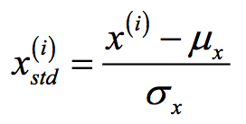

ML 스터디 14주차 : Confusion Matrix / Standardization, Normalization, Regularization / Data Preprocessing
=======================================================================================================

조민지
--------

***

정초이
---------

***

남궁선
---------
## Data Preprocessing

### Missing data
|   A   |   B   |   C   |   D   |
|-------|-------|-------|-------|
|   1   |   2   |   3   |   4   |
|   5   |   6   |  NaN  |   8   |
|   10  |   11  |   12  |   NaN |

NaN : 손실된 데이터 (누락값)

***목표 : 손실된 데이터 문제를 해결해야한다.***
#### 1. 손실된 데이터가 있는 row(데이터) 또는 col(특성) 을 제거
1. 데이터가 손실된 row 들을 모두 제거한다.

    |   A   |   B   |   C   |   D   |
    |-------|-------|-------|-------|
    |   1   |   2   |   3   |   4   |

2. 데이터가 손실된 column 들을 모두 제거한다.

    |   A   |   B   |
    |-------|-------|
    |   1   |   2   |
    |   5   |   6   |
    |   10  |   11  |

-> 단점 : 도움이 될 수 있는 다른 데이터도 버릴 수 있다.

#### 2. 손실된 데이터에 영향을 받지 않는 학습 모델을 사용한다.
- Decision Tree 기반의 학습 모델(e.g. Random Forest) 등은 누락값에 영향을 받지 않아 데이터를 그대로 사용할 수 있다..
- 그러나 Linear Regression 이나 SGD 알고리즘은 누락값이 있을 때 사용할 수 없다.

#### 3. 대체값을 사용한다.
1. 누락값이 속한 row나 col의 평균값으로 치환한다 (산술평균, 조화평균, 기하평균 etc...).
    (예시 : 누락값이 속한 col의 산술평균으로 치환)
    |   A   |   B   |   C   |   D   |
    |-------|-------|-------|-------|
    |   1   |   2   |   3   |   4   |
    |   5   |   6   |   7.5 |   8   |
    |   10  |   11  |   12  |   6   |
    

2. 손실된 데이터를 전부 특정 값으로 치환한다.
    - ex) NaN을 전부 2로 치환한다.

    |   A   |   B   |   C   |   D   |
    |-------|-------|-------|-------|
    |   1   |   2   |   3   |   4   |
    |   5   |   6   |   2   |   8   |
    |   10  |   11  |   12  |   2   |

#### 4. ML 알고리즘을 사용하여 예측한다.
- Regression
- Decision trees
- Clustering algorithms (K-Mean\Median etc.)

### Categorical data
|   Color   |   Size   |   Price   |   Class label   |
|-------|-------|-------|-------|
|   green   |   M   |   10.1   |   class1   |
|   red   |   L   |   13.5   |   class2   |
|   blue  |   XL  |   15.3  |   class1   |

***목표 : 위 표에 있는 Color, Size, Class Label feature의 Catergorical data를 numerical 데이터로 바꾸어 주어야 한다.***

#### 1. Mapping ordinal features
XL : 3
L : 2
M : 1

|   Color   |   Size   |   Price   |   Class label   |
|-------|-------|-------|-------|
|   green   |   1   |   10.1   |   class1   |
|   red   |   2   |   13.5   |   class2   |
|   blue  |   3  |   15.3  |   class1   |

#### 2. Encoding class labels
Class1 : 0
Class2 : 1

|   Color   |   Size   |   Price   |   Class label   |
|-------|-------|-------|-------|
|   green   |   1   |   10.1   |   0   |
|   red   |   2   |   13.5   |   1   |
|   blue  |   3  |   15.3  |   0   |

#### 3. Performing one-hot encoding on nominal features
|Color_blue|Color_green|Color_red|   Size   |   Price   |   Class label   |
|-------|-------|--------|-------|-------|-------|
|0|1|0|   1   |   10.1   |   0   |
|0|0|1|   2   |   13.5   |   1   |
|1|0|0|   3  |   15.3  |   0   |

### Unbalanced dataset
|Positive|Negative|
|-----|-----|
|50|950|

***목표 : 한 쪽으로 과도하게 편향된 데이터셋의 문제를 해결한다.***

#### 1. Undersampling
- 다수 집단에서 랜덤하게 데이터를 버려서 소수집단과 갯수를 맞춘다.
- 소수 집단도 데이터셋이 충분하다면 유용하다.
- 단점 : 데이터가 손실된다.
    |Positive|Negative|
    |-----|-----|
    |50|50|
- 다양한 Undersampling 기법들
    - Tomek’s link method
    - Condensed Nearest Neighbour
    - One Sided Selection
    - Edited Nearest Neighbours
    - Neighbourhood Cleaning Rule  
#### 2. Oversampling
- 소수 집단에서 랜덤하게 데이터를 반복생성하여 다수 집단과 갯수를 맞춘다.
- 데이터셋의 크기가 작고, 데이터를 버리기 어려울 때 유용한다.
- 단점 : 데이터셋의 Noise가 증가한다.
    |Positive|Negative|
    |-----|-----|
    |950|950|
- 다양한 Oversampling 기법들
    - ADASYN
    - SMOTE  
#### 3. (Over + under) sampling
- SMOTEENN: SMOTE + ENN
- SMOTETomek: SMOTE + Tomek
#### Unbalanced dataset을 사용할 때의 모델 성능 평가방법
- 코헨의 카파(Cohen's kappa) : 실데이터와 예측된 분류 집합에 관한 강건한 척도
- F1 Score : 정확도와 재현률의 조화평균

### Multicollinearity
- 회귀분석에서 독립변수들 간에 강한 상관관계가 나타나는 문제
    e.g) X1 = aX2 + bX3, (X1, X2, X3 는 독립변수)

#### 1. 진단법
1. 결정계수 R^2값은 높아 회귀식의 설명력은 높지만 식안의 독립변수의 P-value값이 커서 개별 인자들이 유의하지 않는 경우가 있다. 이런 경우 독립변수들 간에 높은 상관관계가 있다고 의심된다.
2. 독립변수들간의 상관계수를 구한다.
3. 분산팽창요인(Variance Inflation Factor)를 구하여 이 값이 10을 넘는다면 보통 다중공선성의 문제가 있다.

#### 2. 해결법
1. 상관관계가 높은 독립변수중 하나 혹은 일부를 제거한다.
2. 변수를 변형시키거나 새로운 관측치를 이용한다.
3. 자료를 수집하는 현장의 상황을 보아 상관관계의 이유를 파악하여 해결한다.
4. PCA(Principle Component Analysis)를 이용한 diagnol matrix의 형태로 공선성을 없애준다. 

### Outlier
- 특정 범주보다 지나치게 떨어져있거나, 크거나 작은 값

#### 해결법
- Outlier 제거
- Quantile Binning
    - 연속형 숫자를 범주형으로 변환한다.
    - e.g) [1,2,3,4,5,6,7,8,100] -> [1,1,1,2,2,2,3,3,3]

### Data feature scaling
- Normalization

- Standardization

    
***
