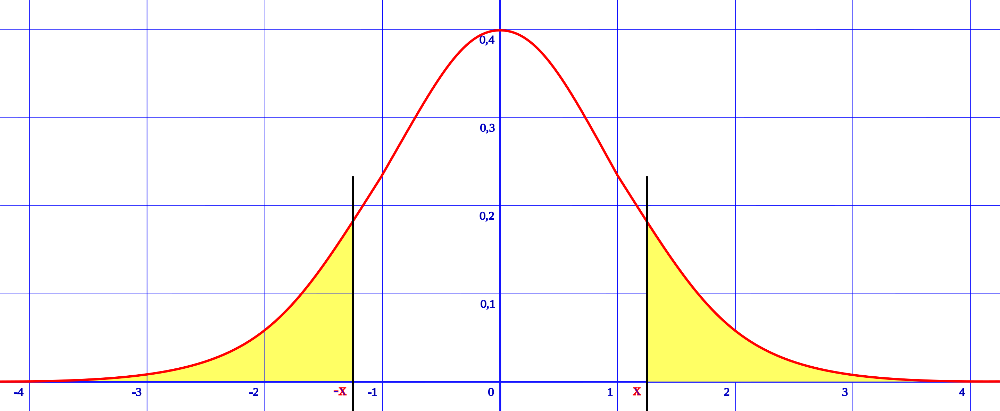
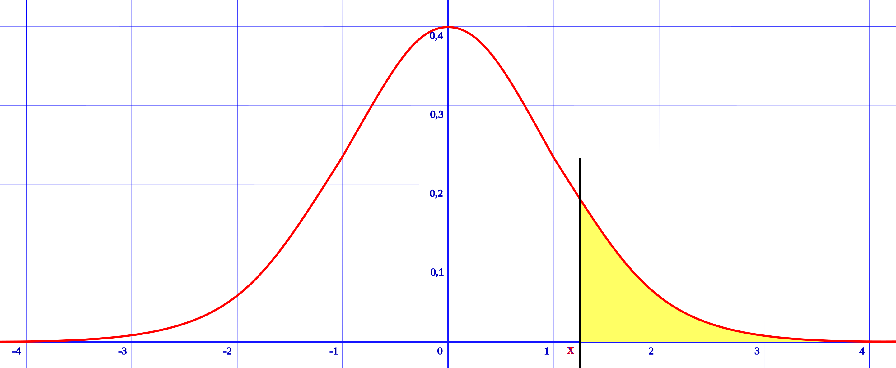

ML 스터디 15주차 : Feature selection, PCA, Statistical Hypothesis Test, Weight initialization, Hyperparameter optimization
=======================================================================================================

조민지
--------
### Weight Initialization, Hyperparameter optimization

참고 영상 [모두를 위한 딥러닝 강좌 시즌 1 lec 10-2 Weight 초기화 잘해보자](https://www.youtube.com/watch?v=4rC0sWrp3Uw&list=PLlMkM4tgfjnLSOjrEJN31gZATbcj_MpUm&index=32&t=0s)

1. #### Initializing weights W

   - network를 구상할때 가장 먼저 해야할 일은 weight matrix를 *적절히 초기화* 하는 일이다. 

      

     같은 코드를 실행시켜도 위와 같이 다른 그래프를 볼 수 있다. random 값에 따라 달라지는 것이다.

     모든 weight값을 0 으로 설정한다면? Deep Learning 알고리즘은 전혀 동작하지 않을 것이다. x의 값이 무엇이건 0이되고, 지금까지 거쳐온 layer의 값들 또한 모두 무효가 된다.

     적절히 알맞게 초기화하기 위해서는

     - Not all 0's
     - Challenging issue ( 이 분야는 아직 해야할 것이 많다.)
     - Hinton et al. (2006) "A Fast Learning Algorithm for Deep Belief Nets" - Restricted Boatman Machine(RBM) 현재는 RBM보다 쉽고 좋은 방법들이 존재한다.

   - 잠깐, RBM

     -   Restriction이란 단어를 붙인 것은 같은 layer 안에서 어떠한 연결도 존재하지 않기 때문이다. 단지 2개의 layer에 대해서만 x 값을 사용해서 동작하고 y 값도 사용하지 않는 초기화 방법이다.

       

     -   RBM은 현재 layer와 다음 layer에 대해서만 동작한다. **(forward)** 현재 layer에 들어온 x값에 대해 weight을 계산한 값을 다음 layer에 전달한다. **(backward)** 이렇게 전달 받은 값을 이번에는 거꾸로 이전(현재) layer에 weight 값을 계산해서 전달한다.

     -   forward와 backward 계산을 반복해서 진행하면, 최초 전달된 x와 예측한 값(x hat)의 차이가 최소가 되는 weight을 발견하게 된다.

     - > 예를 들어 설명: MLP는 각 인식을 해야하는 사람들의 특징(차이)을 구분하기 위해 Network를 Training한다면, RBM은 각 사람들을 잘 표현할 수 있는 Feature들을 찾기 위해 Network을 Training한다고 볼 수 있다.

     - RBM은 주로 Neural Network에서 초기 weight값은 Training Data에 보다 적절하게 만들기 위한 용도로 활용되며, RBM 자체가 분류나 예측의 목적으로 사용되지 않는다.
     - 사실 구현이 쉽지 않다...

   - Good news

     - 2010년에 발표된 xavier 초기화와 2015년에 xavier초기화를 응용한 He 초기화가 있따. 이들 초기화 방법은 놀랍도록 단순하고, 놀랍도록 결과가 좋다.

     - Xavier initialization: X. Glorot and Y.Bengio, "Understanding the difficulty of training deep feedforward neural networks," in International conference on artificial intelligence and statistics, 2010

     - He's initialization: K. He, X. Zhang, S. Ren, and J. Sun, "Delving Deep into Rectifiers: Surpassing Human-Level Performance on ImageNet Classification," 2015

     - xavier(샤비어) - 남자의 이름으로 나온다.

       

     - 입력값의 개수를 fan-in, 출력값의 개수를 fan-out이라고 부른다.

     - 간단한 수식으로 RBM와 비슷한 성능을 냈다고 한다.

     - 홍콩 중문대 박사과정에 있던 he가 2015년에 이 방식을 사용해서 ImageNet에서 3% 에러를 달성했다.

       

2. #### Hyperparameter optimization

   - 신경망이나 기계 학습에서의 Hyperparameter란?

     - 신경망 학습을 통해서 튜닝 또는 최적화 해야하는 주 변수가 앙니라, 학습 진도율이나 일반화 변수처럼 사람들이 선험적 지식으로 (priori) 설정하거나 또는 외부 모델 메커니즘을 통해 자동으로 설정이 되는 변수를 말한다.
     - meta-parameters 또는 free parameter라고도 불린다.

   - Hyperparameter은 어떤 것들이 있을까?

     - Learning rate
     - Cost function
     - Regularization parameter
     - Mini-batch 크기
     - Training 반복 횟수
     - Hidden unit의 개수
     - 가중치 초기화(Weight initialization)
     - etc..

   - *신경망을 통한 학습이란 결과적으로 cost function(loss function)을 최소화 시키는 가중치(weight)와 바이어스 값들을 찾아내는 것이지만, overfitting의 문제에 빠지지 않고 기대했던 수준의 결과를 얻으려면, hyperparameter에 대한 최적화 작업이 선행이 되어야 한다.*

     하지만, 안타깝게도 아직까지는 황금룰(golden rule)이 없다는 것이 일반적이고, 많은 부분을 경험이나 설계자의 직관에 의존해야 하는 실정이다. *신경망을 처음 시작하는 사람들에게는 골칫거리가 된다.*

     그래도 나름 정리해본 최적화 하는 방법

     - Manual Search
       - 말 그대로 설계자의 직관이나 경험에 기반하여, 최적의 파라미터를 추정하고 결과를 관찰하는 방법이다. 어떤 *탐색 이론* 을 사용하는가에 따라 시간이나 질이 달라질 수 있다. 값을 하나씩 대입해보며, 최적의 답을 찾거나 시간이 허용하는 선에서의 최적의 답을 찾으면 된다.
     - Grid Search
       - 큰 들은 Manual search와 큰 차이는 없다. 단, Grid 경우는 선험적인 지식을 활용하여 문제를 분석하고, hyperparameter의 범위를 정한다. 그리고 그 범위 안에서 일정한 간격으로 점을 정하고 그 점들에 대해 1개씩 차례로 실험을 해보면서 최적의 값을 찾은 후 다시 best로 추정이 되는 점을 기준으로 세분화 하여 최적값을 찾는 방법이다.
     - Random Search
       - Grid 와 마찬가지로 선험적인 지식을 이용하여 hyperparameter의 범위를 정한다. 그 이후에 일정한 간격으로 탐색하는 대신에 무작위로 최적값을 찾는 작업을 진행을 한다. Grid와 별 다를 것이 없어 보이지만, hyperparameter을 찾는 과정에서 시간이라는 *유한 자원* 을 어떻게 사용해야할지가 다르다. Bengio 박사의 "Random search for Hyperparameter optimization" 논문에 따르면, 일정한 시간안에 결과를 내야하는 경우, Random search를 할 때 더 좋은 결과를 내는 경향이 있다고 한다.
     - Bayesian optimization
       - 앞서 살펴본 3가지 방식이 좀 효율적이지 못한 감이 있다. Bayesian optimization의 기본 원리가 prior knowledge을 활용하는데 있으므로, 현재까지의 실혐 결과를 바탕으로 통계적인 모델을 만들고, 그것을 바탕으로 다음 탐색을 해야 할 방향을 효과적으로 정하자는 것이 이 방법의 핵심이다. 
       - Adams 쓴 "Practical Bayesian optimization of machine learning algorithms"가 있따.
       - Bayesian optimization 방법을 사용하면 Random search나 Grid search를 사용하는 것에 비해 좀 더 짧은 시간에 최적값을 찾아내는 경향이 있다.
***

정초이
---------

***

남궁선
---------
## 통계적 가설 검정(statistical hypothesis test)

### 0. 정의
- 통계적 추측의 하나로서, 모집단 실제의 값이 얼마가 된다는 주장과 관련해, 표본의 정보를 사용해서 가설의 합당성 여부를 판정하는 과정을 의미한다.

### 1. 유의확률(p-value)
- Probability value
- 귀무가설이 맞다는 전제 하에, 표본에서 실제로 관측된 통계치와 ***같거나 더 극단적인*** 통계치가 관측될 확률
- 관찰된 데이터가 귀무가설과 양립하는 정도를 0에서 1 사이의 수치로 표현한다.
- p-value가 작을수록 그 정도가 약하다고 보며, 유의수준 (대개 0.05나 0.01 등) 보다 작을 경우 귀무가설을 기각하고 대립가설을 채택하는 것이 관례이다.

-

> 양측 꼬리 유의 확률, 

-

> 우측 꼬리 유의 확률

### 2. 귀무가설(H0)
- Null Hypothesis
- 부정하고자 하는 주장
- 의미있는 차이가 없거나, 보수적인 주장.
- 이것이 맞거나 맞지 않다는 통계학적 증거를 통해 증명하려는 가설이다.
- ex) 한국 남성의 평균 신장은 175cm이다.

### 3. 대립가설(H1)
- 귀무가설 과 반대되는 가설
- 연구자가 연구를 통해 입증되기를 기대하는 예상이나 주장하는 내용
- 우리가 적극적으로 입증하려는 주장, 차이가 있음을 통계적 근거를 통해 입증하고자 하는 주장
- ex)
  - 제 1형 양측검정: 한국 남성의 평균 신장은 175cm 이 아니다. ( 신장 != 175cm )
  - 제 2형 좌측검정: 한국 남성의 평균 신장은 175cm 보다 작다. ( 신장  < 175cm )
  - 제 3형 우측검정: 한국 남성의 평균 신장은 175cm 보다 크다. ( 신장  > 175cm )

### 4. 유의수준(α)
- 오류를 허용할 범위
- 유의확률이 유의수준보다 ***작다면 보통은*** 귀무가설을 기각한다 and 대립가설을 채택한다.
- 유의확률이 유의수준보다 ***크다면 보통은*** 귀무가설을 채택한다 and 대립가설을 기각한다.

### 5. 예제
- 유의확률 = 0.03
- 유의수준 = 0.05
- 귀무가설 : 한국 남성의 평균 신장은 175cm 이다.
- 대립가설 : 한국 남성의 평균 신장은 175cm 보다 작다.
- 결과 : 유의확률이 유의수준 보다 작으므로, 한국 남성의 평균 신장은 175cm 보다 작다고 본다.

### 6. 오류
|   구분   |   H0 True  |   H0 False   |
|-------|-------|-------|
|   H0 채택  |   Valid   |   2종 오류   |
|   H0 기각   |   1종 오류   |   Valid   |
#### 1. 1종 오류
- 귀무가설이 참인데도 귀무가설을 기각하는 경우
- ex) 한국 남성의 평균 신장이 2m 이하인게 분명한데도 잘못된 표본을 토대로 평균 신장이 2m 가 넘는다고 주장하는 학자
#### 2. 2종 오류
- 귀무가설이 거짓인데도 귀무가설을 채택하는 경우
- ex) 한국 남성의 평균 신장이 150cm 이상인게 분명한데도 잘못된 표본을 토대로 평균 신장이 150cm 가 안된다고 주장하는 학자

***
