# ML 스터디 3주차 : Activation functions

## **정초이**

# Activation Function
## Activation Function의 의의

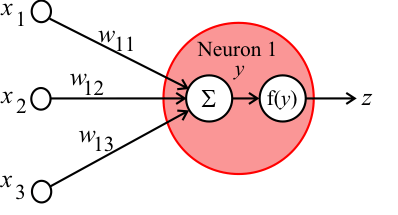
- 뉴럴 네트워크의 개별 뉴런에 들어오는 입력신호의 총합 x<sub>1</sub>w<sub>1</sub> + x<sub>2</sub>w<sub>2</sub> + b 
를 출력 신호(y)로 변환하고(그대로 사용 X),
<br>그 값에 따라 신호 전달을 활성화할지 말지(z)를 결정하는 함수.

1. 가중치가 곱해진 입력 신호와 편향의 총합을 계산한다.
<br> a = x<sub>1</sub>w<sub>1</sub> + x<sub>2</sub>w<sub>2</sub> + b 
2. a를 활성화 함수인 h()에 넣고 출력 신호(y)를 출력한다.
<br> y = h(a)

* * *
## Activation Function의 종류
### ***선형 함수 linear function***

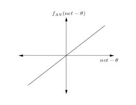
```
h(a)=cx
```
- 뉴럴 네트워크 초기에는 선형함수를 활성화 함수로 사용했다.
- 요즘에는 비선형 함수를 활성화 함수로 사용하는데, 선형함수를 사용하면 신경망에서 층을 이루는 의미가 사라지기 때문이다.
	- ex) 선형함수인 h(x)=cx를 활성화함수로 사용한 3층 네트워크
	이 3층 네트워크를 식으로 나타내면 y(x)=h(h(h(x)))가 되는데,
	이 식을 전개해보면 y(x)=c<sup>3</sup>x 가 되어서,
	y(x)=ax와 똑같은 식이 된다. (a = c<sup>3</sup>으로 설정해주면)
    
	즉, 은닉층이 없는 네트워크가 된다.
    - 선형 시스템을 망에 적용시, 망이 깊어지지 않는다.
    - 아무리 망이 깊어지더라도 1층의 은닉층으로 구현이 가능한 것!
	뉴럴 네트워크에서 층을 쌓으려면, 활성화함수로는 **비선형 함수**를 사용해야 한다.
    > 비선형 함수 : 직선 1개로 표현이 되지 않는 함수

### ***계단 함수 step function***

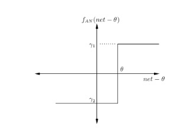

**a = x<sub>1</sub>w<sub>1</sub> + x<sub>2</sub>w<sub>2</sub> + b 
y = h(a)
h(a) = 0 (a<=Θ),1 (a>Θ)**

- 그 이후에는 임계값(Θ)을 경계로 출력이 바뀌는 step function을 사용했다.
- 하지만, step function은 미분이 불가능하다.
	- gradient descent를 통한 훈련이 **불가능** 하다.
	> **gradient descent(기울기 하강)**
현재의 위치에서 기울기에 비례하여 단계적으로 함수의 최소 또는 최대에 접근하는 점근적인 언덕 오르기 (hill climbing) 알고리즘. 코드 구현은 [여기](https://blog.naver.com/devace/221220100562)
- 출력층을 구성하는 뉴런의 수를 아무리 크게 하여도 두 가지 패턴으로밖에 구분하지 못한다.

### ***시그모이드 함수 sigmoid function***
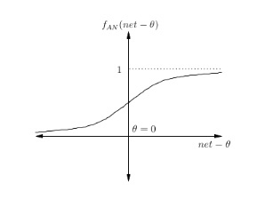
- 0 또는 1만 출력할 수 있는 계단 함수와 달리, [0,1] 범위의 float를 표현할 수 있다.
- 로지스틱 회귀 분석에 사용된다.
- 유한의 범위 [0,1]로 트레이닝이 안정적이다.
- 맨 끝 같은 경우에는 기울기가 매우 작다.
- 어떤 부분의 X의 작은 변화가 Y의 값의 큰 변화를 야기시킨다. 어떤 부분은 그 반대...
	- 즉, Y값을 시그모이드 함수의 양쪽 끝으로 향하게 한다.
	- 양쪽 끝 지역에서의 시그모이드 함수의 기울기는 매우 작아서, 거의 0에 가깝다.
	- **vanishing gradient**
		- 신경망의 은닉층이 많아질수록 역전파에 의한 가중치 보정의 의미가 없어지는 문제.
		- 아래에 자세한 설명을!
- Y값이 0에서 중간값이 아니다.
	- 항상 양수의 값을 반환한다.
	- 훈련 초기에 입력값이 함수의 양쪽 끝에 집중되는 경향이 있고, 기울기가 작을 수 있다.
	- 초기 랜덤 가중치값들의 균형이 맞기까지 시간이 걸리는 원인이 된다.


### ***하이퍼볼릭 탄젠트 함수 hyperbolic tangent function***
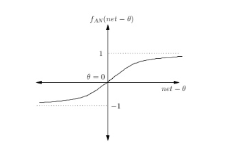
- 쌍곡탄젠트 함수.
- 출력값이 [-1,1]로, sigmoid의 범위를 살짝 확장시킨다.
- activations 가 saturate, 포화상태이다. (sigmoid와 동일)
- 출력값이 0에서 중간값이다.
- sigmoid 함수보다 더 가파른 기울기를 가진다
- sigmoid 함수보다 빠른 학습을 위해 사용된다.


### ***렐루 함수 ReLU(Recified Linear Unit) function***
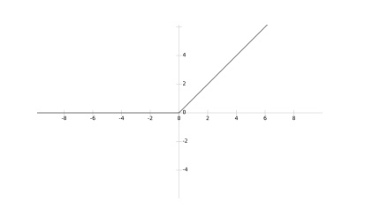
- **x가 양수이기만 하면** 기울기가 1로 일정하므로 기울기가 죽는 현상을 피할 수 있다.
- 미분이 편리하고, 계산복잡도가 낮다.
- sigmoid, hyperbolic tangent 보다 학습수렴 속도가 6배나 빠르다

- 0을 기준으로 대칭인 모양은 아님
- 범위가 유한하지 않다. [0,inf)라서 비안정화된 training 이라고 한다.
> inf : infinite
- 무한의 범위가 단점이 될 수도 있지만, 학습 수렴을 가속화한다는 점에서 장점으로 작용 할 수도 있다.
- x가 음수이면 기울기가 무조건 0이 된다 --> 기울기가 죽는다!
	- normalized 된 가중치들을 가진 입력값들은, 50%는 0으로 활성화 될 것이다.
	- 0이 되면 그 데이터들을 다시 활성화될 일이 없게 되고, 데이터들의 capacity를 낭비하는 것이 된다.

### ***리키 렐루 함수 Leaky ReLU function***
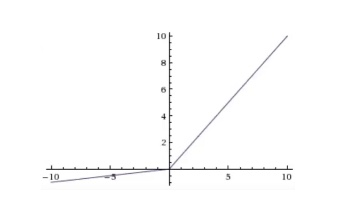
- ReLU의 **dying ReLU** 문제를 해결하기 위해 나온 것.
	- 음수 부분에 작은 기울기를 도입해서 문제를 해결했다.

```
f(x) = αx for x<0
	x for x>=0

f'(x) = α for x<0
	1 for x>=0
```

 * 더 변형된 형태로 randomized Leaky ReLU 함수도 있다.
 <br>

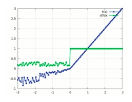

<br>

### ***소프트맥스 함수 Softmax function***
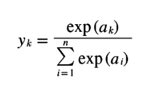

n : 출력층의 뉴런 수
y<sub>k</sub> : k번째 뉴런의 출력신호
a<sub></sub> : k번째 뉴런의 입력신호

> exp(x) --> e<sup>x</sup> 의 값 반환

- 출력층에서 사용하는 함수
- ***다범주 분류 multinomial classification*** 를 하기 위해 사용
- 입력받은 값을 0~1사이의 값으로 모두 정규화하며 출력 값들의 총합은 항상 1이 되는 특성 
-> **확률 개념!** (식에서도 볼 수 있듯, 분모는 분자의 총합과 같다)
- 어떤 클래스에 속할 확률이 얼마인지를 나타내주는 것이 소프트맥스 함수의 출력
- 지수 함수가 포함되어 있어서 프로그래밍 언어로 구현 시 오버플로우가 발생할 수 있다.
아래의 방법으로 개선이 가능하다.
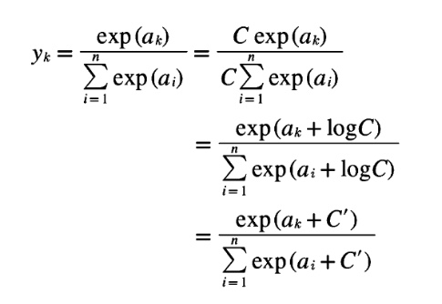

* * *
## Perceptron에서 Activation Function이 동작하는 위치
는 예제를 통해 살펴볼 것!
### ***연산 정의***
#### 1. sum 계산
sum
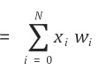

N : 입력 벡터의 크기

#### 2. 활성함수 정의
간단히 계단함수를 활성함수로 사용해보자!
```
f(sum) = 0 for sum < thresold
	 1 for sum >= thresold
```

#### 3. 학습연산 정의 (가중치 조절)
##### w<sub>i</sub> = w<sub>i</sub> + ηx<sub>i</sub>(T - f(sum))

η = 학습률
T = 목표값

출력층 뉴런의 출력값과 목표값의 차이가 허용 오차보다 크면 출력층 뉴런의 가중치를 조정해야 한다.
<br>
위 식을 이용해서 가중치를 조정한다.

### ***예제 : AND 연산 학습***
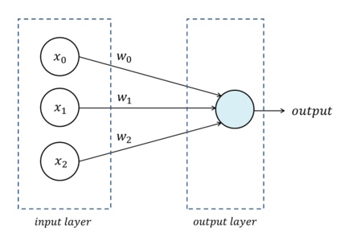
<br>
위와 같은 퍼셉트론의 구조로 AND 연산을 학습하고,
학습률 η를 0.05로 설정한다.

#### 학습 데이터
x<sub>1</sub>|x<sub>2</sub>|T
-|-|-
0|0|0
0|1|0
1|0|0
1|1|1

#### 가중치 및 편향 초기화하기
가중치와 편향의 가중치를 -0.5와 0.5 사이 임의의 값으로, 편향의 입력값은 -1로 초기화한다.

w<sub>0</sub> = 0.3
w<sub>1</sub> = 0.4
w<sub>2</sub> = 0.1
x<sub>0</sub> = b = -1


#### 각 학습 벡터에 대한 출력값 계산 및 가중치 조정
##### 1. t=1
첫번쨰 학습 벡터 (0,0,0) 에 대한 출력값을 계산한다.

x<sub>1</sub> = 0
x<sub>2</sub> = 0
sum = w<sub>1</sub>x<sub>1</sub> + w<sub>2</sub>x<sub>2</sub> + w<sub>0</sub>x<sub>0</sub> = 0 + 0 + (-0.3) = -0.3
<br> **f(sum) = 0**

출력값이 목표값과 일치하므로 가중치를 수정하지 않고
<br> 두 번째 학습 벡터(0,1,0)에 대한 출력값을 계산한다.<br>
이렇게 출력값과 목표값이 같은지 판단하기 위해 출력값을 계산할 때 사용된다.<br>
출력값이 목표값과 다를 때에는, 가중치 조절 식을 사용하여 가중치를 수정한다.

* * *
* * *
# 과제
## Hidden layer에서 사용되는 Activation Functions
- 각 층의 뉴런에서 신호를 전달할 때, 가중치와 입력을 곱한 값들의 총 합을 이용해서 어떠한 값을 다음 층으로 보낼지는
<br> 계단 함수, 시그모이드 함수, ReLU 함수를 사용한다.
- 마지막 층인 출력층에는 소프트맥스 함수와 항등 함수를 사용한다.

### ***회귀와 분류 문제***
- 회귀 문제 : 연속적인 수치를 예측하는 문제 (ex : 키 예측 : 168cm 정도)
- 분류 문제 : 데이터가 어느 클래스에 속하는지에 대한 문제 (ex : 사람인지 동물인지) 

### ***출력층에서 자주 사용되는 활성화 함수의 종류***
- 항등 함수 *identify function* : 입력을 그대로 출력. 입력신호 = 출력신호
	- 일반적으로 회귀에 항등 함수를 사용한다.
- 소프트맥스 함수 *softmax function* : 어떤 '클래스'로 속할 **확률**이 얼마인가를 나타내 줌
	- 일반적으로 분류에 소프트맥스 함수를 사용한다.
	- 거의 출력층에 사용한다.

### ***은닉층에서 자주 사용되는 활성화 함수의 종류***
계단 함수, 시그모이드 함수, ReLU 함수 ... 엄청 많다!
그러나 아무거나 골라 쓰면 되는 건 아니다.

사용할 활성화 함수를 선택할 때에는 풀고자 하는 문제의 종류를 고려해서 선택한다.

- ReLU : 보통 은닉층에 사용된다.
- Sigmoid : 목표가 binary 할 때, 출력층 뿐만 아니라 은닉층에서도 쓰인다.
	- 그러나 vanishing gradient 문제, 중심값이 0이 아닌 문제가 존재해서 점차 사용하지 않는 추세...
- Tanh : sigmoid와 비슷하나 범위가 [-1,1]. 마찬가지로 출력층 뿐만 아니라 은닉층에서도 쓰인다.
	- 그러나 vanishing gradient 문제는 존재


* * *
## Sigmoid, ReLU 의 수식 및 의의


### ***sigmoid 함수의 수식 및 의의***


#### 로지스틱 회귀분석
선형 방법을 유지하면서 확률의 공리에 어긋나지 않는 방법 중 가장 보편적인 것
-> 로지스틱 함수를 연결함수로 사용한 로지스틱 회귀분석
> 로지스틱 함수가 sigmoid fuction!

-> sigmoid 함수를 사용함으로써,
<br> 선형이라는 직관적인 성질을 띄면서, 결과값의 범위가 0~1로 제한되어 확률값의 예측에 사용할 수 있음.
> 시그모이드 함수를 사용하는 자세한 이유는 [여기](https://icim.nims.re.kr/post/easyMath/64)


### ***ReLU 함수의 수식 및 의의***
```
f(x) = max(0,x)
f'(x) = 0 for x<0
	1 for x>=0
```

- sigmoid의 vanishing gradient 문제 해결
- 미분 편리, 학습 속도 빠름 (연산 부담 적음)
- ReLU 함수 설명 부분과 맨 밑의 [ReLU의 장점](https://github.com/iamcho2/AUSG-machine-learning-study/blob/master/5.%20activation-function.md#relu%EC%9D%98-%EC%9E%A5%EC%A0%90) 부분 참고...


* * *
## Sigmoid의 단점

### ***vanishing gradient problem***
- 인공신경망을 gradient 기반 방법 (ex : 역전파 알고리즘)으로 학습시킬 때 일어나는 문제.
- 네트워크의 초기 layer들의 파라미터들을 조정하고 학습하기 힘들게 만든다.
- 층이 깊어질수록 악화된다.

- 기울기 기반 학습법의 특징
	- 그 파라미터의 값이 얼마나 크게 네트워크의 출력에 영향을 미치는지에 기반해서 학습한다.
		- 특정 파라미터의 값의 변화가 결과에 미치는 변화가 매우 작다면 ? --> 시그모이드 함수
		-  = 초기 층의 파라미터들이 아주 많이 변해도 결과 값에 별 영향을 주지 않는다는 것.

- 원인
	- 입력값을 아주 작은 범위에 비선형적으로 '우겨넣는다'.
		- ex) 시그모이드 함수 : 실수를 작은 범위인 [0,1]에 우겨넣는다.
	- 입력의 큰 변화가 출력의 작은 변화밖에 만들지 못한다. = 기울기가 작다.
	- 여러 층을 이러한 비선형 함수들로 쌓아 올릴수록 문제는 악화된다.
		- 각 영역을 거치면서 큰 입력 영역을 작은 영역으로 보낼 것이기 때문에
		 결과적으로 첫번째 영역의 커다란 변화가 결과값에 제대로 영향을 미치지 못 하게 된다.

- 해결
	- '우겨넣지' 않는 함수를 활성화 함수로 선택하면 된다.
	- ReLU가 대표적인 해결책이다.
		

* * *
## ReLU의 장점

- 범위가 무한대이다.
- 패턴 표현들이 대부분의 가중치에 상당한 영향을 준다.
	- 그래서, 훈련이 끝나갈수록 학습 속도를 작게 조절하는 것이 좋다. ReLU의 선형성과, 포화되지 않는 형태 때문!
- 선형이고, saturate problem이 없어서 sigmoid, tanh 보다 수렴*converge* 속도가 빠르다.
- x값이 0을 기준으로 선형발현/미발현이라는 간단한 형태
	- 연산량이 많은 exponential을 사용하지 않아서 연산 부담이 적다.


* * *

--------------
## **조민지**
