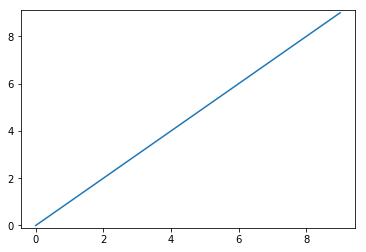
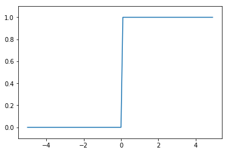
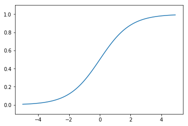
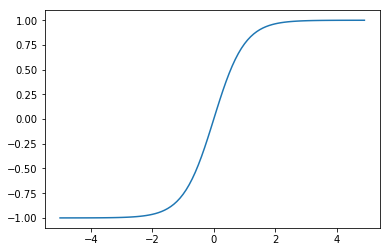
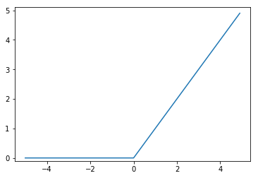
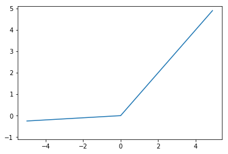

# ML 스터디 4주차 : Numpy로 Activation functions 및 Perceptron 구현하기

## **정초이**

# implementation
## with Numpy, Matplotlib


```python
import numpy as np
import matplotlib.pylab as plt
```

## Activation Functions
### ***선형 함수 linear function***


```python
def linear_function(x):
    y = x
    return y

x = np.arange(10)
y = linear_function(x)
plt.plot(x,y)
plt.ylim(-0.1, 9.1)
plt.show()
```





### ***계단 함수 step function***


```python
def step_function(x):
    y = x > 0
    return y.astype(np.int)

x = np.arange(-5.0, 5.0, 0.1)
y = step_function(x)
plt.plot(x,y)
plt.ylim(-0.1, 1.1)
plt.show()
```





### ***시그모이드 함수 sigmoid function***


```python
def sigmoid(x):
    return 1 / (1+np.exp(-x))

x = np.arange(-5.0, 5.0, 0.1)
y = sigmoid(x)
plt.plot(x,y)
plt.ylim(-0.1, 1.1)
plt.show()
```





### ***하이퍼볼릭 탄젠트 함수 hyperbolic tangent function***


```python
def hyperbolic_tangent(x):
    return np.tanh(x)

x = np.arange(-5.0, 5.0, 0.1)
y = hyperbolic_tangent(x)
plt.plot(x,y)
plt.ylim(-1.1, 1.1)
plt.show()
```





### ***렐루 함수 ReLU(Recified Linear Unit) function***


```python
def relu(x):
    return np.maximum(0,x)

x = np.arange(-5.0, 5.0, 0.1)
y = relu(x)
plt.plot(x,y)
plt.ylim(-0.1, 5.1)
plt.show()
```





### ***리키 렐루 함수 Leaky ReLU function***


```python
def leaky_relu(x):
    alpha = 0.05
    return np.where(x > 0, x, x * alpha)

x = np.arange(-5.0, 5.0, 0.1)
y = leaky_relu(x)
plt.plot(x,y)
plt.ylim(-1.1, 5.1)
plt.show()
```





### ***소프트맥스 함수 Softmax function***


```python
def softmax(x):
    e_x = np.exp(x - np.max(x))
    return e_x / np.sum(e_x)
```

## Perceptron
### ***AND***


```python
def AND(x1, x2):
    x = np.array([x1, x2])
    w = np.array([0.5, 0.5])
    b = -0.99
    tmp = np.sum(w*x) + b
    result = 0 if tmp <= 0 else 1

    return result

print(AND(0,0))
print(AND(1,0))
print(AND(0,1))
print(AND(1,1))
```

    0
    0
    0
    1


### ***XOR including AND, OR, NAND***


```python
def AND(x1, x2):
    w1, w2, theta = 0.5, 0.5, 0.99
    tmp = x1*w1 + x2*w2
    result = 0 if tmp <= theta else 1

    return result

def OR(x1, x2):
    w1, w2, theta = 0.5, 0.5, 0.49
    tmp = x1*w1 + x2*w2
    result = 0 if tmp <= theta else 1

    return result

def NAND(x1, x2):
    x = np.array([x1, x2])
    w = np.array([-0.5, -0.5])
    b = 0.99
    tmp = np.sum(w*x) + b
    result = 0 if tmp <= 0 else 1

    return result

def XOR(x1,x2):
    s1 = NAND(x1,x2)
    s2 = OR(x1,x2)
    result = AND(s1,s2)

    return result

print(XOR(0,0))
print(XOR(1,0))
print(XOR(0,1))
print(XOR(1,1))
```

    0
    1
    1
    0


--------------
## **조민지**

## Numpy를 사용해서 Perceptron 구현하기

Numpy는 파이썬이 계산과학분야에 이용될때 핵심 역할을 하는 라이브러리입니다. Numpy는 고성능의 다차원 배열 객체와 이를 다룰 도구를 제공합니다. 만약 MATLAB에 익숙한 분이라면 Numpy 학습을 시작하는데 있어 이 튜토리얼이 유용할 것입니다.

[Numpy 메뉴얼](http://aikorea.org/cs231n/python-numpy-tutorial/#numpy-arrays)


## - numpy를 사용하여 Activation function 구현하기

[jupyter로 actication function구현](https://github.com/jominjimail/ausg/blob/master/ML/week4/test/numpy_activation_function.ipynb)

### 1. 시그모이드 함수(로지스틱 함수) : Curved in two directions, like the letter "S"
```python
def sigmoid(x): 
    a = []  
    for itr in x:   
        a.append(1/(1+np.exp(-itr)))  
    return a  
    
x = np.linspace(-8, 8, 100)  # -8 ~ 8 사이의 100개의 값 생성
sig = sigmoid(x) 
```


### 2. 하이퍼볼릭 탄젠트 : 
```python
def tanh(x): 
    a = []  
    for itr in x:   
        a.append(np.sinh(itr)/np.cosh(itr))  
    return a  

x = np.linspace(-3, 3, 100)  
tan = tanh(x)  
```


### 3. 렐루 : ReLu(Rectified Linear Unit)
```python
def relu(x): 
    a = []  
    for itr in x:   
        a.append(np.maximum(0,itr))  
    return a  

x = np.linspace(-10, 10, 100) 
ReLu = relu(x)  
```


### 4. Leaky 렐루 :
```python
def Leaky_relu(x): 
    a = []  
    for itr in x:   
        a.append(np.where(itr > 0 , itr , itr*0.01))  
    return a  

x = np.linspace(-10, 10, 100)  
L_ReLu = Leaky_relu(x)  
```
### 5. 항등 함수 : identity function
```python
def identity(x): 
    a = []  
    for itr in x:   
        a.append(itr)  
    return a  

x = np.linspace(-10, 10, 100)  
iden = identity(x)  
```


### 6. 소프트 맥스 : softmax
```python
def softmax_sol(x):
    expX = np.exp(x-np.max(x))
    sumExpX = np.sum(expX)
    return expX / sumExpX

over = np.array([900 , 1000 , 1000])
over_result = softmax_sol(over)
```

```python
```


## - numpy를 사용하여 단층 Perceptron 구현하기

[jupyter로 Perceptron구현](https://github.com/jominjimail/ausg/blob/master/ML/week4/test/numpy_myperceptron.ipynb)

### 1. AND
```python
def andPerceptron(x1, x2):
    w1, w2, theta = 0.5, 0.5, 0.7
    netInput = x1*w1 + x2*w2
    if netInput<=theta:
        return 0
    elif netInput > theta:
        return 1
```


### 2. NAND
```python
def nandPerceptron(x1, x2):
    w1, w2, theta = -0.5, -0.5, -0.7
    netInput = x1*w1 + x2*w2
    if netInput<=theta:
        return 0
    elif netInput > theta:
        return 1
```


### 3. OR
```python
def orPerceptron(x1, x2):
    w1, w2, bias = 0.5, 0.5, -0.2
    netInput = x1*w1 + x2*w2 + bias
    if netInput<=0:
        return 0
    else:
        return 1
```


## - numpy를 사용하여 다층 Perceptron 구현하기

### 1. XOR

```python
def xorPerceptron(x1 , x2):
    s1 = nandPerceptron(x1, x2)
    s2 = orPerceptron(x1, x2)
    y=andPerceptron(s1, s2)
    return y
```


## - numpy를 사용해서 activation function 다층 구현하기

[2_floor perceptron](http://localhost:8890/notebooks/Documents/GitHub/ausg/ML/week4/test/numpy_2floor_perceptron.ipynb)

### 1. sig sig sig 

```python
def feedForward(neuralNetwork , ia):
    W1, W2, W3 = neuralNetwork['W1'], neuralNetwork['W2'], neuralNetwork['W3']
    b1, b2, b3 = neuralNetwork['b1'], neuralNetwork['b2'], neuralNetwork['b3']
    
    z1 = sigmoid(np.dot(ia , W1) + b1)
    print("1st 은닉층 값 : " + str(z1))
    
    z2 = sigmoid(np.dot(z1 , W2) + b2)
    print("2nd 은닉층 값 : " + str(z2))
    
    y = sigmoid(np.dot(z2 , W3) + b3)
    return y
```


### 2. sig sig sig soft
```python
def feedForward_soft(neuralNetwork , ia):
    W1, W2, W3 = neuralNetwork['W1'], neuralNetwork['W2'], neuralNetwork['W3']
    b1, b2, b3 = neuralNetwork['b1'], neuralNetwork['b2'], neuralNetwork['b3']
    
    z1 = sigmoid(np.dot(ia , W1) + b1)
    print("1st 은닉층 값 : " + str(z1))
    
    z2 = sigmoid(np.dot(z1 , W2) + b2)
    print("2nd 은닉층 값 : " + str(z2))
    
    z3 = sigmoid(np.dot(z2 , W3) + b3)
    print("3rd 은닉층 값 : " + str(z3))
    
    y = softmax(z3)
    return y
```


