# ML 스터디 5주차 : Mathmatics for studying AI

## **정초이**

## 1 기초수학

### ***로그***

#### 정의

a>0, a!=1, b>0 일 때
ax = b <=> x = logab

> a : 밑, b : 진수

#### 성질

- loga1 = 0
- logaa = 1

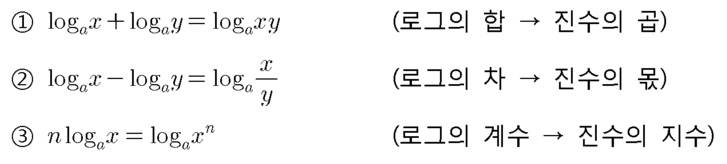

#### 밑변환 공식

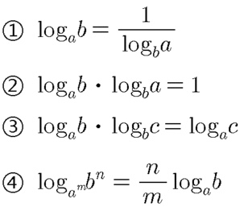

#### 자리 바꾸기 공식

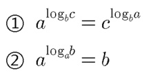

> 수학에서는 밑이 2일 경우 생략하지 않지만, 공학(특히 컴퓨터공학) 부분에서는 밑이 2일 때 역시 생략해 주는 경우가 있다. 그 이유는 컴퓨터가 2진법을 사용하기 때문이다.

### ***절댓값과 유클리드 거리***

두 점을 (p1, p2, p3, p4, ...)와 (q1, q2, q3, q4, ...)로 표기한 경우
 
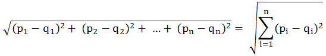

### ***수열***

#### 정의

자연수 집합(또는 양의 정수 집합)을 정의역으로 갖는 함수. 쉽게 말하자면, 수를 늘어놓고 그것에 순번을 붙이는 것

> 수열의 n 번째 항 : 일반항

##### 귀납적 정의

n 번째 항의 값을 n-1번째 이전의 값들로 계산하여 얻을 수 있는 경우를 수열의 귀납적 정의라 하며 이 식을 점화식이라고 부른다.

#### 등차수열

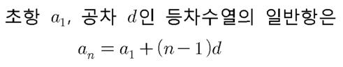

#### 등비수열

등비수열의 합

- 무한등비수열일 경우
  

#### 수열의 극한

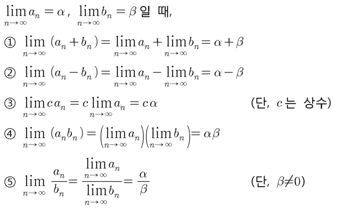

## 2 미분

### ***최댓값, 최솟값, 극대값, 극소값***

#### 최대, 최소

함수 f의 정의역 D상의 모든 원소 x에 대하여 

- f(c)≥f(x)가 성립하면 f(c)를 D에서의 f의 **최댓값**이라 하고
- f(c)≤f(x)가 성립하면 f(c)를 D에서의 f의 **최솟값**이라 한다.

#### 극대, 극소

- x=a를 포함하는 어떤 열린 구간에서 함수 f(x)의 값이 f(a)이하이면 
  함수 f(x)는 x=a에서 극대가 된다고 하며, f(a)를 **극댓값** 이라고 한다.
- x=b를 포함하는 어떤 열린 구간에서 함수 f(x)의 값이 f(b)이상이면 
  함수 f(x)는 x=b에서 극소가 된다고 하며, f(b)를 **극솟값** 이라고 한다.

### ***합성함수 미분***

- 미분 : 기울기 !
  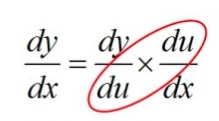

x에 대한 y의 변화의 비율을 구하고 싶은데 직접적인 비율은 안 나와있고
x,y에 대한 매개체 u와의 비율만 나와있을 때
그 두 비율을 곱하면 바로 x에 대한 y의 변화의 비율이 나온다.

> ex) f(x)=(2x+5)3

### ***상미분, 편미분***

#### 상미분방정식

> 공업수학 책 chap1~6....?

미지함수(未知函數)가 독립변수를 한 개만 포함한 미분방정식이다. 함수가 제n계까지의 도함수를 가지면, 함수에 대해 n계 상미분방정식이라 한다.

#### 편미분방정식

다변수함수(多變數函數)에 대하여, 그 중 하나의 변수에 주목하고 나머지 변수의 값을 고정시켜 놓고 그 변수로 미분하는 일을 가리킨다.

>

## 3 선형대수

### ***벡터, 스칼라***

#### 벡터

크기와 동시에 방향을 갖는 물리량

##### 벡터의 합

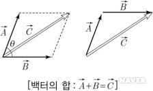

##### 벡터의 차

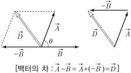

##### 벡터의 분해

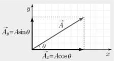
방향 : tanθ = Ay/Ax

#### 스칼라

크기만을 나타내는 물리량

### ***내적, 외적***

#### 내적

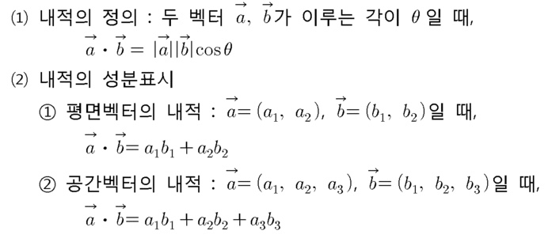

##### 내적의 성질

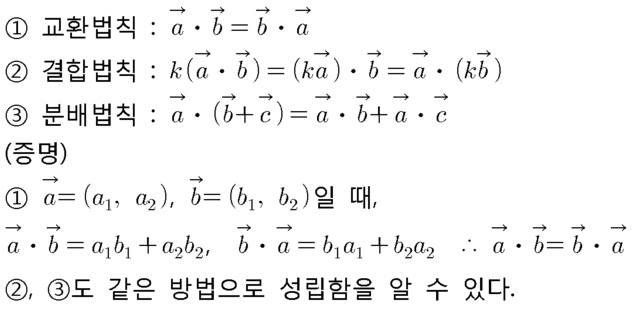

- 내적과 절대값의 관계
  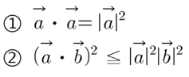

##### 내적의 응용

#### 외적

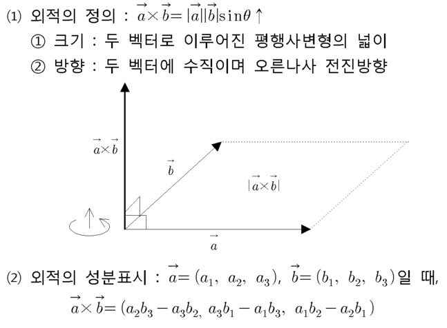

### ***L1 norm, L2 norm***

- Norm : 벡터 공간의 각 벡터들에 일종의 '크기'를 부여하는 함수.

임의의 벡터 x에 대한 Lp Norm은 다음과 같이 정의된다.
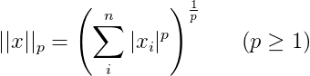

p=1 이면 L1 norm, p=2 면 L2 norm.

#### L1 norm

**벡터 내의 모든 원소의 절댓값의 합**

ex)

#### L2 norm

**벡터 내의 모든 원소의 절댓값 제곱의 합의 제곱근**

ex)
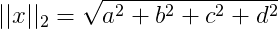

#### 그 외

p가 커져도 구하는 방법은 같음.

ex) p=5일 때
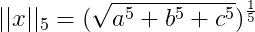

#### Norm의 의미

특정 벡터가 대한 1차원 상에서 가지는 크기

### ***행렬 연산***

#### 덧셈

: A, B가 같은 꼴의 행렬일 때, A와 B의 대응하는 성분의 합을 성분으로 하는 행렬을 A와 B의 합이라 하고, A + B로 나타낸다.

#### 뺄셈

: A, B가 같은 꼴의 행렬일 때 B + X = A를 만족하는 행렬 X를 A에서 B를 뺀 차라 하고, A - B로 나타낸다.

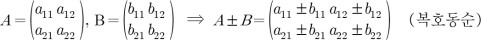

#### 실수배

k가 실수일 때
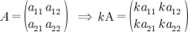

#### 곱셈

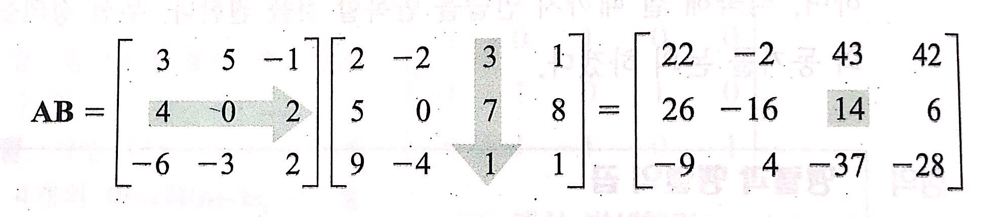

### ***eigen value, eigen vector (고윳값, 고유벡터)***

#### 고유값

자료행렬을 요약하는 수치로서, 특성치라고도 한다. 각 고유값은 그에 대응하는 고유벡터가 있다. A는 m×n 행렬이고, 는 Rn의 영벡터가 아닌 벡터이다. 스칼라 λ에 대하여 A**x**가 의 스칼라 λ배, 즉 A**x** = λ**x**일 때, λ를 A의 고유값(eigenvalue of A)이라 하고, **x**(**x** != **0**)를 λ에 대응하는 A의 고유 벡터(eigenvector of A)라 한다.

n×n 행렬 A가 서로 다른 고유값을 가지면 A는 대각화가 가능한 행렬이다. 

## 4 확률과 통계

### ***확률***

일정한 조건 아래에서 어떤 사건이나 사상(事象)이 일어날 가능성의 정도. 또는 그런 수치. 수학적으로는 1을 넘을 수 없고 음이 될 수도 없다. 
  확률 1은 항상 일어남을 의미하고, 확률 0은 절대로 일어나지 않음을 의미한다.

### ***확률변수와 학률분포***

#### 확률변수

변수X가 취할 수 있는 모든 값 x1, x2, x3, ···, xn에 대해 이들 값을 취할 확률 p1, p2, p3, ···, pn 이 정해져 있을 때, 이 변수X

#### 확률분포

확률변수X가 취하는 값 xi와 xi를 취할 확률 pi와의 대응관계

### ***결합확률과 조건부 확률***

#### 결합확률

확률개념이 의미를 갖기 위해서는 다음의 세 조건을 반드시 만족해야만 한다고 한다.
 
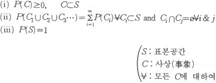

이러한 보조개념하에서 결합확률을 설명하면, 서로 배반되는 두 사상 E, F가 있을 때, 두 사상이 연속적으로 또는 동시에 일어나는 확률을 P(E∩F)로 표시하고, E, F의 결합확률이라 한다. 

결합확률의 계산은 각각의 사상이 나타날 확률이 서로 독립이면 P(E · F)=P(E) · P(F) 또는 ƒ(x, y)= ƒ(x) · ƒ(y)로 된다.

#### 조건부 확률

조건부확률은 P(E/F)로 표시되며, 그것은 주어진 조건(즉, F가 일어났다는 전제 등)하에서 어느 사상 E가 일어날 확률을 의미한다. 

### ***기댓값***

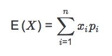

수학적 기망값이라고도 하며, 변량(變量) X가 각각 x1, x2, x3,…, xn이라는 값을 취할 확률이 각각 p1, p2, p3,…, pn일 때, 기댓값 X=x1p1＋x2p2+x3p3＋…+xnpn이다.

변수 X의 기댓값 E(X)는 변수 X에 가중치를 부여하여 구해진 평균(weighted mean)이다. **모평균**이라고도 한다.
확률변수 의 기댓값 E(X)는 X의 중심적 성향 또는 분포의 무게중심을 알려준다.

큰 수의 법칙에 의하면 동일한 실험을 독립적으로 반복할 때, 결과들의 평균은 어떤 값으로 수렴한다. 이때 기댓값이 극한값이 된다.

### ***평균, 분산, 공분산***

#### 평균

일반적으로 평균(average)은 어떤 값들의 집합의 적절한 특징을 나타내거나 요약하는 것을 의미한다.
산술평균, 기하평균, 조화평균 등이 있음.

#### 산술평균 

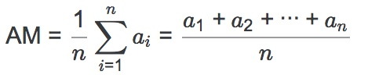

##### 모평균 μ

확률 변수의 기댓값.

##### 표본 평균 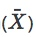

표본의 데이터를 모두 더한 후 표본의 데이터 갯수 n으로 나눈 것.
  표본 분산이나 표본 표준 편차와 달리 n-1로 나누는 것이 아닌 것에 주의.

#### 기하평균

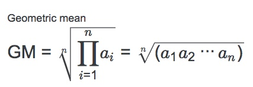
숫자들을 모두 곱해서 n√을 취해서 얻는 평균. 연속변수의 경우 확률변수에 p제곱을 한 뒤에 
  적분한 것을 다시 p제곱근을 취하고 나서 독립변수의 측도로 나눠준 뒤 p를 0으로 보내면 된다.

#### 조화평균

숫자들의 역수의 산술평균을 구한 후 그것을 역수로 취한 평균.

속변수의 경우 확률변수에 역수를 취한 것을 확률측도에 대해 적분한 뒤 다시 역수를 취한 후 독립변수의 측도로 나눠주면 된다. 역수를 취해야 하므로 숫자들 중에 0이 끼어있으면 계산할 수 없다. 또한 각 숫자들이 모두 양수여야만 의미있는 값이 얻어진다. 

> 조화 평균은 기하평균과 같이 표본들이 비율이나 배수이지만 각 표본값은 독립적이고 표본끼리 곱한 값이 의미가 없을 때, 효율이나 속도 처럼 역수가 의미가 있을 때, 각 표본들이 비중이 같을 때 주로 쓰인다.

#### 멱평균

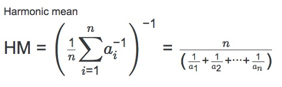

위 세가지 평균을 일반화한 것으로, 산술평균은 1차평균, 기하평균은 0차평균, 조화평균은 -1차평균이 된다.
또한, ∞차로 극한을 취하면 최댓값, -∞차로 극한을 취하면 최솟값이 된다.

#### 분산

변수의 흩어진 정도를 계산하는 지표

분산의 제곱근인 표준편차는 어떤 변수 x에 관하여 그 평균값를 중심으로 보았을 때 각 관측값이 평균적으로 어느 정도 평균값에서 벗어나 있는지를 계산한 것이라고 생각해도 좋다.

V(X) = E((X-μ)2)
= E(X2)-μ2

#### 공분산

두 확률변수 사이에 정의된 공분산은 두 확률변수의 선형관계에 대한 정보를 알려 준다.
공분산의 부호를 통하여 두 변수의 선형관계를 대략적으로 추측할 수 있다.

확률 변수 X의 증감에 따른 확률 변수 Y의 증감의 경향에 대한 측도이다.

> 공분산은 두 변수의 측정 단위에 따라 크기가 달라지므로 공분산의 크기 자체로 두 확률변수의 선형관계를 판단하는 것은 부적절하다. 선형관계를 판단하는 수치로는 공분산을 표준화한 상관계수를 사용하는 것이 일반적이다.

Cov(X, Y) = E[(X - μ1)(Y - μ2)] = E(XY) - E(X)E(Y)

### ***상관계수***

두 정량적 변수 간의 선형적 연관성을 재는 척도
--> 두 변수가 얼마나 관계가 있나? 를 알아보는 정도로 사용

corr(X,Y) , r 로 표현
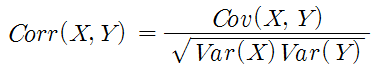

(표현 방식이 다른 것)

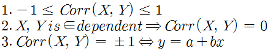
이 성질들을 만족한다.

--------------
## **조민지**
## 1. 기초수학

- 로그

  : log는 수학함수의 일종으로, 어떤 수를 나타내기 우해 고정된 밑을 몇 번 곱하여야 하는지를 나타내는 함수이다.
  - 지수함수와 역의 관계이다.
  
  
  
- 절대값, 유클리드 거리

  : absolute value는 실수가 실수선의 원점과, 복소수가 복소평면의 원점과 떨어진 거리를 나타내는 음이 아닌 실수이다.
  
  : Euclidean distance는 두 점 사이의 거리를 계산할 때 흔히 쓰는 방법이다. 
  
  
  
- 수열

  : seauence는 수 또는 다른 대상의 순서있는 나열이다. 나열 순서를 생각해야 하고 중복이 허용된다는 점에서 집합과 구분된다.
  - 수열의 각수를 '항'이라 한다.
  - 유한수열, 무한수열이 있다.
  - 일반항(n번째항) 
  
  - n번쨰항까지의 합
  
  - 수열의 합과 일반항과의 관계

  

  - 대표적으로 등차수열, 등비수열, 조화수열이 있다.

## 2. 미분 Differentiation

  : 미분은 함수의 최대값이나 최소값을 구하는 경우에 사용된다.

- 최댓값, 최솟값

  : 함수 f가 일정 구간 안의 모든 점에서 미분 간으하고 구간 내 임의의 점 c에서 1차 미분이 0이면 (f'(c) =0) 함수 f는 점 c에서 지역 최대값이나 최소값을 갖는다.
  - 함수 f(x)의 최대값은 함수의 양 끝 값과 극대값중 가장 큰 값이다.
  - 함수 f(x)의 최소값은 함수의 양 끝 값과 극소값중 가장 작은 값이다.

  

- 극대값, 극소값

  : 미분가능한 함수 f(x)가 x=a 에서 극값을 가지면 f'(a) = 0이다.
  - 극대점 f'(a)=0 이고 x=a의 좌우에서 f'(x)의 부호가 (+)에서 (-)로 바뀌면 f(x)는 x=a에서 극대이고, f(a)는 극대값이 된다.
  - 극소점 f'(b)=0 이고 x=b의 좌우에서 f'(x)의 부호가 (-)에서 (+)로 바뀌면 f(x)는 x=b에서 국소이고, f(b)는 극소값이 된다.

  

- 합성함수 미분
  - 합성합수의 미분법 1
  
  
  
  
  
  - 합성합수의 미분법 2
  
  
  
  

- 상미분, 편미분 (유형에 의한 분류)
  - 상미분
  
  : 한 개 또는 그 이상의 종속변수의 단 하나의 독립변수에 대한 도함수들만을 포함하는 방정식을 상미분방정식(ODE: orfinary differential equation)이라 한다.
  
  
  
  [상미분방정식 모델링 예시](http://blog.naver.com/PostView.nhn?blogId=la6354&logNo=220605971726&categoryNo=21&parentCategoryNo=0&viewDate=&currentPage=1&postListTopCurrentPage=1&from=search)

  
  - 편미분
  
  : 한 개 또는 그 이상의 종속변수의 두 개 이상의 독립변수에 대한 편도함수들을 포함하는 방정식을 편미분방정식(PDE: partial differentail equation)이라 한다.
  
  
  

## 3. 선형대수

- 벡터, 스칼라

  : vector 방향과 크기의 의미를 모두 포함하는 표현 도구입니다.

  

  : scalar는 크기와 방향을 가지는 벡터에 대비하는 개념으로, 크기만 있고 방향을 가지지 않은 양을 말한다. 벡터의 크기는 스칼라이다. 

  좌표계가 변함에 따라 벡터의 각 성분은 바뀐다. 그러나 벡터의 크기는 스칼라이고 좌표계가 변해도 그 값은 불변이다. 이 그림에서 (x,y) 로 표현되는 좌표계에서 굵은 선으로 표시한 벡터의 성분은 (5,0)이지만, 벡터 자체가 변하지 않음에도 좌표계가 (x', y')으로 바뀌었을 때 각 성분은 (4,3)으로 바뀌었다. 하지만 두 좌표계에서 벡터v의 크기는 5로 불변이고 따라서 스칼라이다.

  

  

- 내적, 외적
  
  - 내적은 scalar product(스칼라곱) 또는 Dot product라고 한다. 
  
  
  - 내적값과 벡터의 크기를 안다면 사이각을 구할 수 있다. 이게 첫번째 내적ㅇ의 의의이다. 
  - 영이 아닌 두 벡터 사이의 각이 직각일 때 두 벡터는 서로 수직 또는 직교한다고 한다. 두 벡터가 수직할 필요출중조건은 
  
  
  - 정사영 문제 (수선의 발)
  
  - 외적은 3차원에서만 정의되는게 큰 특징이다. 유클리드 공간상에서만 쓸 수 있다.(오른손의 법칙)
  
  
  - 외적의 결과는 내적과 달리 벡터이다. 평행하지 않은 두 벡터를 외적한 결과는 그 두 벡터와 수직이기 때문이다.
  - 외적을 이용하면 두 벡터가 평행하다는게 아주 근사하게 설명된다. 
  
- L1 norm, L2 norm
  - Norm은 벡터의 길이 혹은 크기를 측정하는 함수입니다. Norm이 측정한 벡터의 크기는 원점에서 벡터 좌표까지의 거리 혹은 Magnitude라고 합니다.
  
  
    * p는 Lorm의 차수를 의미합니다. p가 1dlaus L1 Norm이고 p가 2dlaus L2 Norm입니다.
    * n은 대상 벡터의 요소 수입니다.
   - L1 Norm을 Taxicab Norm 혹은 Manhattan norm이라고도 합니다. L1 norm은 벡터의 요소에 대한 절대값의 합입니다. 요소의 값 변화를 정확하게 파악할 수 있습니다. L1 regularization, computer visiton 영역에서 사용됩니다.
  
   
   - L2 Norm은 p가 2인 Norm입니다. n차원 좌표평면에서의 벡터의 크기를 계산하기 때문에 유클리드 노름이라고도 합니다. L2 regularization, KNN알고리즘, Kmean 알고리즘에서 사용됩니다.
  
    
  
- 행렬계산
   - 행렬 덧셈
   
   
   - 스칼라 곱
   
   
   - 전치
   
   
   - 행렬 곱셈
   
   

- 고윳값, 고유벡터

  : 고유 벡터는 그 선형 변환이 일어난 후에도 방향이 변하지 않는, 영벡터가 아닌 벡터이다. 
  - n차 정사각 행렬 A와 0 이 아닌 벡터 x (R^n차원에 속함)에 대해 Ax = cx를 만족하는 실수 c가 존재할때 c를 A의 고윳값이라 한다. 또한 고윳값 c에 대응하는 벡터 x를 A의 고유벡터라고 한다. 
  
  
  

## 4. 확률과 통계

- 확률
  : 하나의 사상 혹은 사건이 일어날 수 있는 가능성의 정도
  
- 확률변수와 학률분포
  : 무작위 실험을 했을때, 특정 확률로 발생하는 각각의 결과를 수치적 값으로 표헌하는 변수이다. 
  - ex) 동전을 무작위로 두번 던져서 그림 또는 숫자가 나오는 실험에서 일정한 확률(그림이 나올 확률 1/2 , 숫자가 나올 확률 1/2)을 가지고 발생하는 결과에 실수 값 (예: 앞=1, 뒤=0)을 부여하는 변수를 말합니다.
  - 주사위의 숫자와 같이 유한한 값을 취할 때, 이를 이산확률 변수라고 하고, 키나 몸무게처럼 실수로 연속된 무한한 값을 취할때 이를 연속 확률변수라고 한다.
  
  : 확률분포란 확률변수 x가 특정한 값을 가질 확률을 나타내는 함수를 의미합니다. 
  
  - 이산 확률 분포
    1. 베르누이 분포 
    2. 이항 분포 
    3. 초기하 분포 
    4. 기하 분포
    5. 포아송 분포 
  - 연속 확률 분포
    1. 정규 분포 
    2. T 분포
    3. 카이 제곱 분포
    4. F 분포
  
    [확률 분포](http://bcho.tistory.com/981)
  
- 결합확률과 조건부 확률

  : 2 이상의 확률적 사건을 동시에 고려하는 확률 표현이다. 결합 확률은 2 이상의 사건이 모두 일어날 확률 즉, 동시에 일어날 확률이다.

  : 조건부 확률이란 어떤 사건 B가 일어났을 때 사건 A가 일어날 확률을 일어난다. 사건 B가 발생했을 때 사건 A가 발생할 확률은 사건 B의 영향을 받아 변하는데 이를 조건부 확률이라 한다. 기호로는 P(A|B)라고 표현한다.

  

  - 독립사건에서의 조건부 확률 

  

- 기댓값
  : 기댓값은 각 사건이 벌어졌을 떄의 이득과 그 사건이 벌어질 확률을 곱한 것을 전체 사건에 대해 합한 값이다. 이것은 어떤 확률적 사건에 대한 평균의 의미로 생각할 수 있다. 

  

- 평균, 분산, 공분산
  : 평균은 확률변수의 기댓값. 모평균이라고도 한다.

  : 분산은 그 확률변수가 기댓값으로부터 얼마나 떨어진 곳에 분포하는지를 가늠하는 숫자이다.기댓값은 확률변수의 위치를 나타내고 분산은 그것이 얼마나 넓게 퍼져 있는지를 나타낸다. 

  

  : 공분산은 2개의 확률변수의 상관정도를 나타내는 값이다. 만약 2개의 변수중 하나의 값이 상승하는 경향을 보일 때, 다른 값도 상승하는 경향의 상관관계에 있다면, 공분산의 값은 양수가 될것이다. 반대로 2개의 변수중 하나의 값이 상승하는 경향을 보일때, 다른 값이 하강하는 경향을 보인다면 공분산의 값은 음수가 된다.

  

- 상관계수
  : 상관분석은 두 변수가 서로 어떠한 관계인지를 파악하는 분석이다. 점들이 흩어져 있는 모습을 보고 두 변수의 관계를 파악하는데, 기울기에 따라 양의 상관관계와 음의 상관관계로 나눌수가 있다. 점들이 모여있는 밀도를 표현하는 숫자가 상관계수이다. 부호 r을 사용하고 밀도를 표현한다. (-1 <=r <= 1)이다.
  
  
  
- 최대 가능도 추정
  : 연속확률분포에서 연속사건의 특정확률이 일어날 확률을 모두 0으로 계산된다. 따라서 각 사건들이 일어날 확률을 비교하는 것이 무의미해진다. 따라서 ***가능도*** 라는 개념을 도입한다. ***가능도*** 가 높을수록 일어날 확률이 높다는 것이다.

