# ML 스터디 6주차 : Gradient Descent Alogrithm

## **정초이**

## 1. Cost functions

### ***선형 회귀***

결과값 (output value)을 결정할 것이라고 추정되는 입력값 (input value)과 결과 값의 연관관계를 찾고, 이를 선형 관계를 통해 찾는 방법이 선형 회귀 (Linear regression).

### ***택시 요금 예시로 이해하기***


택시 요금 : 일반적으로 거리에 비례해서 요금 부과.

—> 결과값 (요금)과 입력값 (거리)의 관계를 찾아야 한다!


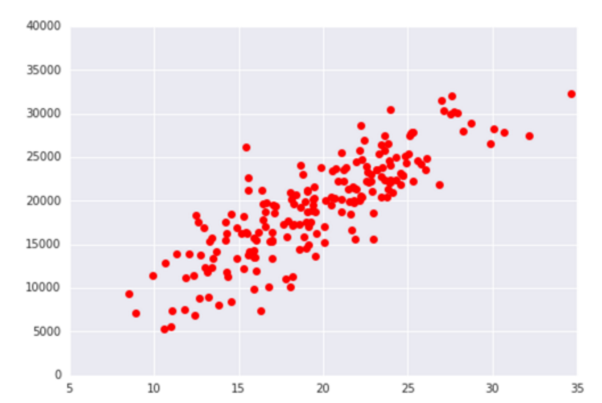


거리별 요금을 그래프로 그리고, 원본 데이터의 거리를 x_data, 거리에 따라 측정된 택시 요금을 y_origin 이라고 하자.


#### 가설 정의하기

거리와 요금이 서로 비례하기 때문에, 

거리(x_data)와 요금(y_data)간의 상관 관계는 다음과 같이 일차 방정식과 형태의 그래프를 그리게 된다고 가정하자.

>  W (Weight): 그래프의 각도, b:  bias

#### y_data = Wx_data + b

이 일차 방정식 형태로 대충 1차원 그래프를 그려보면 같은 형태로 아래와 같이 그래프를 그릴 수 있다.

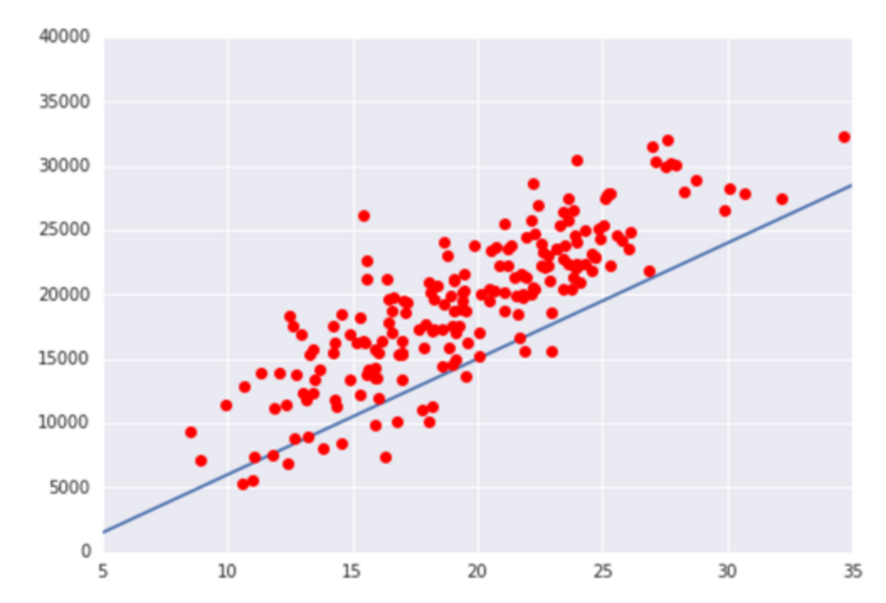

그래프의 기울기가 맞지 않는 것 같아 그래프의 각도와 높이를 아래와 같이 보정할 수도 있다.

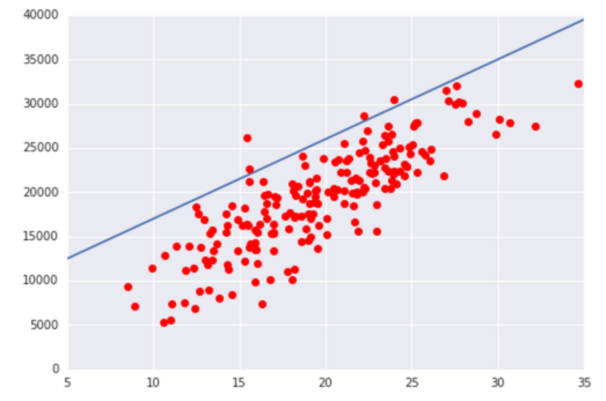

그래프를 보정해도 각도와 높이가 맞지 않는 것 같을 때, 각도 W와 높이 b의 값은 어떻게 찾을 수 있을까?

이때 사용하는 것이 **Cost Function**이다.


### ***Cost Function***

우리가 구하고자 하는 그래프는 실제 값(빨간 점들)에서 그래프(파란 선위의 점들)의 값까지 **차이가 가장 작은 값**을 구하고자 하는 것이다. 

아래와 같이 **y_data=W(x_data) +b**와 같은 그래프를 그렸다고 하자.

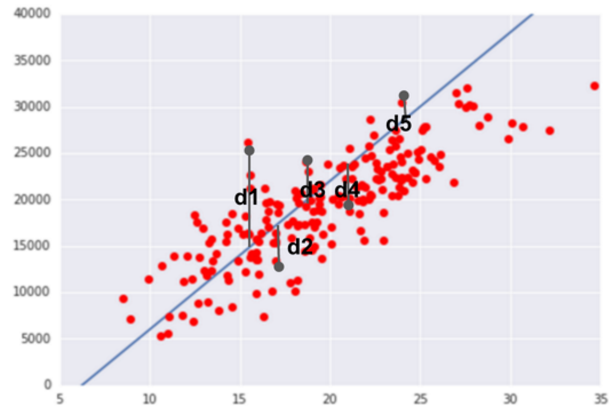

여기서 실제 값과 그래프의 값의 차이는 `측정값-그래프의 값` 인데, 이를 d라고 하자.

이를 변수 이름을 사용해 나타내면 ` d = y_data - y_origin` 이 된다.

> y_origin : x_data에 따라 계산된 실제 요금 값, y_data: 파란색 그래프 위의 값

이때 d는 한개가 아니라 n개이기 때문에, `dn = y_data_n - y_origin_n` 으로 나타낼 수 있다.


```
우리가 구하고자 하는 값

= dn의 합이 최소가 되는 W와 b의 값

= 실제 측정한값과, 예측한 값의 차이가 최소가 되는 W와 b
```


dn은 위의 그래프에서 처럼 그래프 위에도 있을 수 있지만 (dn이 양수일 때), 그래프 아래에도 있을 수 있다, (dn이 음수일 때). 

합을 구하면, 예측 선에서의 실측값 까지의 거리의 합이 되지 않기 때문에, dn에 대한 제곱을 사용하자. (절댓값을 사용하기도 함)

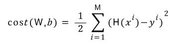

> 평균을 사용하기 위해 데이터의 개수만큼 나눠주기도 하고, 1/2를 해주기도 하는 것 같다.
>
> 1/2를 해주는 이유는 나중에 신경망 학습에서 W의 gradient를 구할 때 계산을 간단히 하기 위함이다.

위와 같이 모든 오차의 값의 제곱을 합하고 데이터의 개수로 나누면 오차의 제곱의 평균이 된다.

오차를 가장 적게 만드려면 위 함수의 값을 최소화해야 하며, 이 함수가 **비용함수** *Cost(W,b)*이다.


### ***비용함수의 종류***

### Sum of squared error


- Linear regression 에서 많이 사용함.
  - 2차 함수처럼 표현 가능 —> 오차가 클 수록 cost 값이 비례하여 커짐

### Sum of squared error의 학습 규칙

미니배치 / 모든 x 전체를 한번 돌 때 마다 (1 epoch)

**각 가중치 <- 각 가중치 - eta \* ( sum( ( cost미분 * 활성함수_미분 ) * x ) / n )**


eta = learning rate

n = x의 개수

cost미분 = p - y

>  여기서 cost미분을 error, (cost미분 * 활성함수_미분)을 delta 라고 부른다.


ex)

활성함수가 f(x) = x 인 경우, delta = error.

활성함수가 sigmoid일 경우,

sigmoid미분 = sigmoid(z) * (1-sigmoid(z)) 이므로,

**delta = (p - y) \* p * (1 - p)**


### Cross Entropy

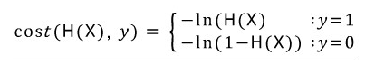

- Logistic regression이나, 분류나, 딥러닝에서 많이 사용.
  - Logistic regression에서 시그모이드 함수를 적용시키면
    H(x)에 지수함수가 포함되어 있는 모양 —> cost 값이 비례하지는 않음.
  - Cost 최소 지점을 찾기 위해 gradient descent algorithm을 사용하는데 sigmoid를 적용시키면
    Sum of squared error는 Local minimum에서 멈출 수 있음 —> Cross Entropy 사용.
- 수렴이 빨라서 Linear regression이 아니라면 cross entropy를 추천한다고 한다.


- y = 1인 경우
  - H(x)가 0이면 cost는 무한대로 급격하게 커진다.
  - H(x)가 1이면 오차는 0이고 cost함수의 값도 0이다.

- y = 0 인 경우
  - H(x)가 1이면 cost는 무한대로 급격하게 커진다.
  - H(x)가 0이면 오차는 0이고 cost함수의 값도 0이다.

이것을 하나의 식으로 다음과 같이 나타낼 수 있다.

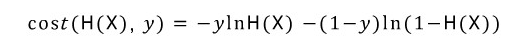

### ***Cross Entropy 의 학습 규칙***

**각 가중치 <- 각 가중치 - eta \* ( sum( ( delta ) * x ) / n )**


**delta = error = p - y**

※ SSE와의 차이는 delta에 sigmoid미분을 곱해주지 않는다는 점 뿐이다. 물론 이는 cross entropy loss function을 각 weight들에 대해 편미분해보면 알 수 있다. [링크](<https://www.ics.uci.edu/~pjsadows/notes.pdf>)를 참고하자.


***


##  2. Gradient Descent Algorithm

### ***개념***

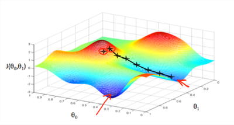

> θ<sub>0</sub> = b,  θ<sub>1</sub>= W, J : cost function

x축은 b, y축은 W, z축은 비용함수의 결과값을 의미한다.

우리는 비용함수의 결과값이 최소가 되는 점을 찾아야 한다.

우리가 빨간색 부분(언덕 위의 x 표시)에 있다고 가정을 하고, 비용함수의 값이 최소가 되는 지점이 빨간 화살표가 가리키는 지점이라고 가정하자.

그렇다면 우리는 빨간 화살표가 가리키는 지점까지 최단 거리로 내려가야 하는데 그 길이 검정색 선으로 나타나 있다.


**빨간 언덕**: 첫 dataset을 투입했을 때, **검정 선**: 학습과정, **빨간 화살표**: 학습과정 끝에 설계한 가정 함수.


### ***함수***

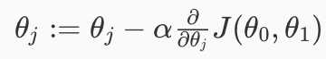

> α: 빨간 언덕에서 내려올 때의 걸음 수. **한번에** 몇 걸음을 걷는가 —> α가 크면 빠르게 내려오는 것.
>
> α값 뒤의 미분값: 언덕의 경사, 기울기.
>
> 수식 := —> 우측 식을 계산한 결과값을 좌측 θ<sub>j</sub>로 대체한다는 뜻.

—> 현재 θ값에서 기울기*걸음 수 만큼 차감함을 의미한다.


### ***주의점***

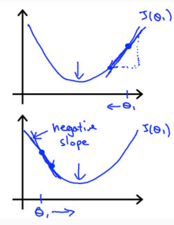  

첫번째 그래프는 기울기가 양수인 경우를 나타낸 것이다. 이 경우에는 -α가 곱해져 θj값이 좌측으로 움직인다. 

두번째 그래프는 기울기가 음수인 경우를 나타낸 것이다. 이 경우에는 -α가 곱해져 θj 값이 우측으로 움직인다.

즉, **기울기가 양수인지, 음수인지와 관계없이 작동한다.**


### ***최종 함수***

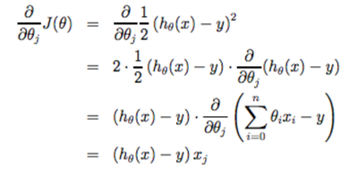

위 식과 같이 미분값 * 비용함수를 풀어서 나타낼 수 있고, 

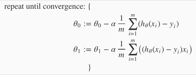

최종적으로 프로그래밍에 적용할 경사하강법의 함수는 위와 같이 나타낼 수 있다.


## 3. Learning rate

### ***Learning rate : 학습 계수***

#### α값

Cost Function에서 α값은, Learning rate 라고 하는 특별한 값이다.

- 너무 크지도, 너무 작지도 않은 값을 가져야 한다.
- 특정 가중치값 W(위에선 θ<sub>j</sub>)가 주어졌을 때 기울기에 α값, Learning rate 값을 곱해서 그 다음 가중치 값을 결정하게 된다.


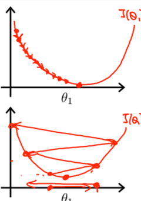 

첫번째 그래프는  α값이 너무 작은 경우를 나타낸 것이다. 여러 번 학습을 해야 최소점에 도달한다. 

아래 그래프는 α값이 너무 큰 경우를 나타낸 것이다. 바로 최소값으로 가지 못하고 지그재그 형태로 점점 올라간다.
이렇게 망한 학습이 되는 것을 Overshooting 이라고 한다. (W, θ<sub>j</sub> 값이 발산해 버린 것, 최소값을 지나쳐 버린 것)

그러므로, **적정한** **α값을 설정**해야 한다. 

> 그렇다고 α값을 지속적으로 수정해 줄 필요는 없다. 최소값으로 내려간 이후에는 기울기값이 0이 되므로 움직이지 않기 때문! 또한, 적절한 α값의 수치를 구하는 방법도 딱히 없다고 한다.  α값을 다양하게 잡아서 cost값이 감소하는 것을 관찰하며 수정하기!
> 적절한 α값은 굉장히 주관적인 말인 것이고, 경험이 중요한 것 같다 ……!


#### 적절한 α값

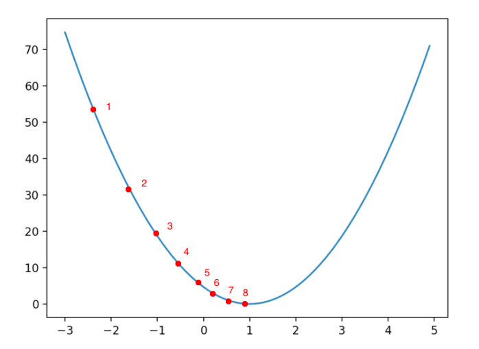

이상적으로 Gradient Descent Algorithm이 실행된다면 추적 순서는 이런 식으로 될 것이다!

## 4. Batch and Mini batch

### ***Batch Gradient Descent 배치 경사 하강법***

- Batch : 전체 데이터를 하나의 덩어리로 묶은 입력 데이터
- 전체 데이터 전체를 매 스텝에서 훈련 데이터로 사용한다. 
- 데이터셋이 커지면 속도가 아주 느려진다.
- 특성 수에 민감하지 않다.
- 수십만 개의 특성에서 선형 회귀를 훈련시키려면 미니 배치 경사 하강법을 사용하는 것이 훨씬 빠르다.

### ***Mini Batch Gradient Descent 미니 배치 경사 하강법***

  - 확률적 경사 하강법이라고도 부른다.
  - 전체 데이터에서 일부만 뽑아 batch를 만든다.
  - 그 후, 그 batch가 전체 데이터인 것 처럼 학습을 진행하며 weight 값을 수정한다. 그리고 이를 많이 반복한다.
- 인공신경망에서 일반적으로 batch라고 하면 이 mini-batch를 의미하는 것이라고 한다.

***

## **조민지**
## week 6 Gradient Descent Algorithm

### 우선
- the hypothesis funcion이란: input(feature)과 output(target)의 관계를 나타내는 함수이다. output값이 나오게 하는 진짜 변수들과 그 변수와 output 사이의 관계식을 정확히 정의하는것은 불가능하다. 우리는 어마어마한 변수들을 모두 고려하고 그 변수들 간의 복잡한 방정식을 찾는 대신 주로 이러이러한 변수들이 output에 영향을 미칠거야 하고 추정하는 일종의 가설을 세우기 때문에 hypothesis라고 부르기 시작한 것으로 여겨진다. 

- linear regression에서의 hypothesis function:


- logistic regression에서의 hypothesis function:


## Cost functions

### linear regression 의 const function:
  - 주어진 데이터에 가장 잘 맞는 직선을 선택하려면 일정한 기준이 있어야 한다. 우리의 hypothesis funcgion의 정확도를 측정하기 위해 cost function을 이용할 것이다. 
  

   - training example 들이 parameter 추정에 이용된다,
   - h(x)가 y와 비슷해지는 세타를 고르는 것이다. 
   - error 값을 최소화하는 값을 찾는것이다. 하지만 error값은 양수값이 될수도 있고 음수값일 수도 있기때문에 제곱값의 합을 구하여 그 합이 최소가 되는 parameter를 찾는 방법이 일반적이다. 이를 LSE(least squared error) criterion이라고 한다.
   - 이 cost function은 mean-squared-error (MSE) 이다. 즉 (error)^2의 평균이 cost값이 된다.     
   - 여기서 error란, 추정한 y값과 y.hat 값의 차이를 말한다. 
 

   - 다만 평균이라면 data 갯수인 m으로 나누어야 하는데 2m으로 나누었다. 2는 계산상의 편의를 위한 것으로 나중에 약분되는 것을 확인하게 될것이다.
  
 


### logsitic regression 의 cost function:
  - linear regressio의 cost function의 LSE criterion을 그래도 사용하면 logsitic regression의 cost function은 non-convex function이 된다. 그래서 조금 다르게 정의한다.
  


  - 이 cost function의 특징은 
    - Maximum likelihood estimation criterion
    - Convex
  

## Gradient Descent Algorithm
- Gradient Descent 는 cost funcgion을 최소화하기 위해 이용할 수 있는 방법 중 하나이며, cost function말고도 각종 optimization에 이용되는 일반적인 방법이다. 

- Gradient Descent Outline : 
  - start with some Theta0, Theta1 ( Theta0 = 0 , Theta1 = 1) 
  - keep changing Theta0, Theta1 to reduce J(Theta0, Theta1) until we hopefully end up at minimum.
  
  - *주의해야할 점은 parameter들을 한번에 업데이트해야한다는 점이다. 만약 Theta0을 먼저 업데이트하여 hypothesis가 바뀌고, 그 hypothesis에 숫자를 대입해 Theta1을 구하면 예상치 못한 문제가 발생할 수 있다.*
  - Gradient descent 가 local optima (slope =0)에 이르면 편미분향이 0이 되므로 더이상 업데이트되지 않는다.
  - 대부분의 경우 최적값에 수렴할수록 편미분항의 크기가 작아져서 조금씩 업데이트되기 떄문에 Alpat값을 수동으로 조절하지 않아도 된다.
  


### linear regression에 gradient descent적용해보기


  - linear regression에서 정의한 cost funcgion을 J(Theta0, Theta1)에 대입하면 된다.
  - linear regression cost function은 convex이므로 항상 global optimal에 수렴한다.


### logsitic regression에 gradient descent적용해보기
  - cost function을 최소화하는 parameter Theta를 찾는 것이 목적이다. J(Theta)가 Convec이므로, gradient descent에 의해 optimal Theta를 찾을 수 있다. 
  


  

## Learning rate alpha
- 상수 Alpha > 0 은 learning rate라고 한다. 이 크기가 클수록 한번에 더 많이 움직이게 되는 것이다.
- 편미분항은 다음에 이동할 방향과 크기를 결정한다. 기울기의 반대방향으로 움직이는데, 기울기가 클수록 더 많이 움직인다.
- learning rate Alpha가 너무 작으면 수렴하는데에 오래걸리는 문제가 생기고, 너무 크면 최소값에 이르지 못해, 수렴하지 못하거나 심지어 발산하는 문제가 생길수 있다. 그러므로 적절한 learning rate를 고르는 것이 중요하다.

## Batch and Mini batch
- "Batch" : Gradient descent의 매 단계에서 모든 training example을 사용한다.
- 한번의 interation을 위해 들어가는 input data이다.
- mini-batch는 한번의 iteration에 인풋 데이터로 한개를 쓰는 경우와 전체 데이터셋을 쓰는 두경우에 비해 어떤 장점이 있을까
- 데이터를 한개 쓰는 경우 장점: 
  - iteration 한번 수행하는데 소요되는 시간이 매우 짧다. cost function의 최적의 값을 찾아가는 과정을 한걸음 한걸음 inimum을 향해 걸어가는 것으로 생각한다면 매우 빠르게 걸을 수 있다.
- 데이터를 한개 쓰는 경우 단점: 
  - 데이터 전체의 경향을 반영하기 힘들다.
  - 하드웨어입장에서 비효울적이다. 데이터 한개만 학습에 사용하면 병렬연산을 안쓰는 것이나 마찬가지이다.
- 전체 데이터를 쓰는 경우 장점:
  - 전체 데이터를 반영하여 한걸음한결음 내딛는다. 즉, cost function의 값을 줄이는 양질의 이동을 하게 된다.
- 전체 데이터를 쓰는 경우 단점:
  - 데이터셋의 크기가 커질 경우 iteration을 한번 수행하는데 소요되는 시간이 매우 길다. 
  - 하드웨어 입장에 부담스럽다. 
- 결국 데이터를 한개 쓰면 빠르지만 너무 헤매고, 전체를 쓰면 정확하지만 너무 느립니다. 즉, 적당히 빠르고 적당히 정확한 길을 찾기 위해 mini-batch를 사용합니다. 

