# ML 스터디 8주차 : Backpropagation Algorithm

## **정초이**

# 오차역전파 알고리즘 (Backpropagation Algorithm)

## 순전파 (Forward propagation)

- 정보가 input layer —> hidden layer —> output layer로 진행
  - 이때 얻은 y값들을 실제 값과 비교해서 error들을 계산하는 과정
- 입력으로 제공된 training data를 이용해서 cost functionn을 구하고, 한 Layer씩 계산해 나아가는 것.


### 일반적인 전체 순서

1. 0에 가까운 작은 숫자로 weight값들을 주고 random으로 시작.
2. dataset 중 first observation을 input layer, one input node에 넣어줌.
3. 왼쪽에서 오른쪽으로, weight 값들에 따라 각각의 neuron activation이 영향받는 방식으로 forward propagation이 진행됨. 원하는 예상 값들이 나올 때 까지 propagation 진행.
4. 예상 값과 실제 값을 비교하고 error 계산.
5. 오른쪽에서 왼쪽으로 back propagation을 진행.
   1. weight들이 다시 계산됨.
   2. 이 과정을 통해 얻어지는 learning rate를 parameter로 사용하여 neural network를 control
6. 1~5 단계를 반복하면서 각각의 observation에 따른 각각의 weight들을 업데이트.
   1. 이 과정을 Reinforcement Learning이라고도 함.
7. 모든 training set이 artificial newral network를 거치면 epoch를 만들고, epoch를 반복함.
   1. Neural network가 원하는 값을 만들어 내도록, cost function 값이 최소화가 되도록 epoch를 반복.


## 합성함수

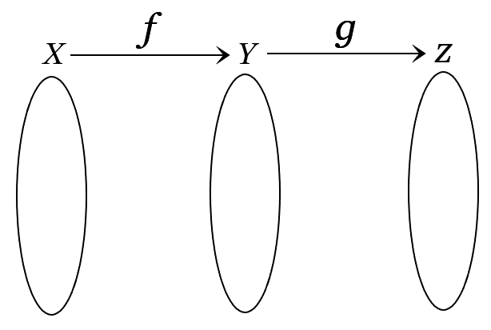

- 함수를 연속적으로 2개 이상 거치는 것.
- 함수 f : 정의역 X, 공역 Y
- 함수 g : 정의역 Y, 공역 Z

==> Y는 f의 공역임과 동시에 g의 정의역이 됨.


### 표현

위의 합성함수는 먼저 f에 의해 대응되고, 그 다음에 함수 g에 의해 대응됨.

- g(f(x))
- g ∘ f(x)
- (g ∘ f)(x)

> g(f(x))라는 함수는 합성 순서가 g—>f가 아닌 f—>g


### 합성함수의 미분

- 두 함수 y = f(x)와 z = g(y)가 미분가능할 때, 합성함수 z = (g ∘ f)(x) = g(f(x))는 미분가능하고

  

  즉,  z' = g'(f(x))f'(x)


- ex)
  - z = (x+y)<sup>2</sup>
  - z = t<sup>2</sup>, t = x+y
  - dz/dx = dz/dt ∘ dt/dx = 2t * 1 = 2(x + y)


## 연쇄법칙

- 여러 함수로 구성된 함수인 합성함수의 미분은 **그 합성함수를 구성하는 각각의 함수의 미분의 곱**으로 나타낼 수 있다.
- dz/dz  ∘  dz/dt  ∘ dt/dx = dz/dt ∘ dt/dx = dz/dx
  - 역전파의 연쇄법칙을 이용하면 결국 해당 변수에 대한 미분과 같다.

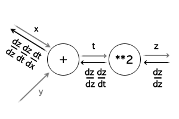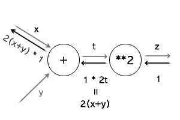

## 역전파 알고리즘

- 최적의 학습 결과를 찾기 위해 역방향으로 에러를 전파시킴.


- 출력에서 생긴 오차를 반대로 입력 쪽으로 전파시키면서 w와 b값들을 갱신시켜 간다.
- Cost function이 w와 b의 함수로 이루어져 있음
  - 출력 부분부터 시작해서 입력 쪽으로 (역방향) 순차적으로 cost function에 대한 편미분을 구함
  - 얻은 편미분 값을 이용해 w와 b의 값을 갱신
- 모든 훈련 데이터에 대해서 이 작업을 반복적으로 수행하다 보면 훈련 데이터에 최적화된 w와 b 값들을 얻을 수 있음.


### 뉴런의 재구성

> 역전파 이해(편미분 부분)를 쉽게 하기 위함

입력을 합하는 부분 & 활성화 함수 부분을 나누어 생각

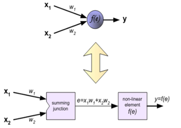

F(e) : sigmoid 함수

e : 각 넷으로부터 입력과 가중치의 곱의 총합


### 기본 스텝


1. Feed forward (앞먹임)
   1. 왼쪽에서 오른쪽으로 계산. 오른쪽 반원에 있는 부분을 수행
   2. 모든 넷에서 들어오는 입력의 합을 sigmoid 함수를 거쳐서 출력
   3. 입력이 최종 출력까지 전달됨.
2. Back - propagation
   1. 최종 출력단에서 구한 기대 출력과 실제 출력간의 차 (error)를 반대 방향으로 전파시키면서 각각 넷이나 뉴런의 가중치(w)와 bias 값 갱신
   2. 오른쪽에서 왼쪽으로 계산. 왼쪽 반원에 있는 부분을 수행
   3. 에러를 역전파할 때에는 sigmoid의 함수의 미분 함수 s'를 사용하고 각 net으로 모두 동일하게 전파


- 정리
  - feedforward & back propagation의 2단계로 구성
  - feedforward : 훈련데이터를 신경망에 인가하고 출력단에서의 에러와 cost function을 구한다
    - 신경망이 충분히 학습이 되지 못한 경우는 오차가 클 것.
    - 그 큰 오차 값을 backpropagation 시키면서 가중치와 바이어스 값을 갱신한다.
  - 훈련 데이터에 대해서 반복적으로 이 과정을 거치게 되면 가중치와 바이어스는 훈련데이터에 최적화된 값으로 바뀌게 됨.
  - 좋은 학습 결과 : 훈련 데이터가 한 쪽으로 치우치지 않고 범용성을 가져야 함

### Sigmoid의 역전파

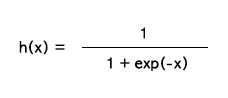

- sigmoid를 쓰는 이유
  - Backpropagation을 해석하기에 편리한 sigmoid 함수의 미분 성질


- 덧셈, 곱셈, 나눗셈, exp에 대한 역전파를 계산하여 구할 수 있지만 순전파의 출력(y) 만으로도 계산할 수 있음.

  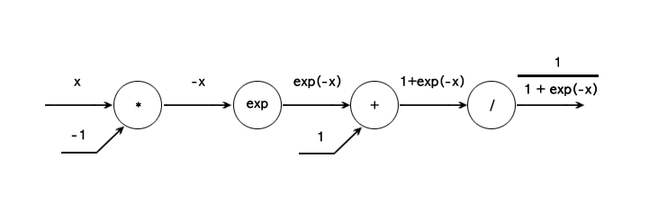

  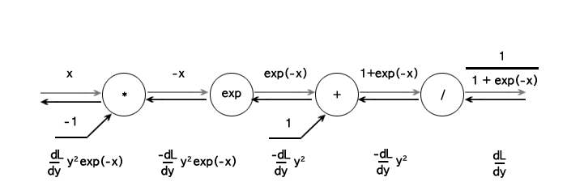

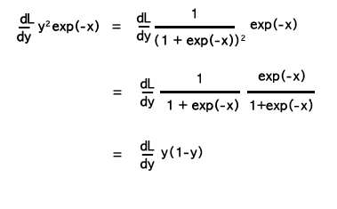

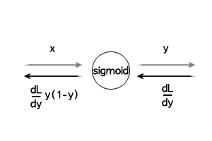

## ReLU의 역전파

- 순전파때의 입력값이 0보다 크면 역전파는 상류의 값을 그대로 하류로 흘러보낸다.

  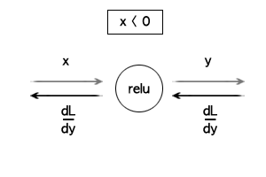 

- 순전파때의 입력값이 0 이하이면 하류로 신호를 보내지 않는다 ( 0을 보낸다. )

  

## Softmax-with-Loss-Layer

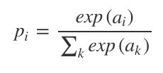

> 분류해야 할 범주 수 n, 함수의 i번째 입력값 a<sub>i</sub> i번째 출력값 p<sub>i</sub>
>
> 소프트맥스 함수의 입력 및 출력벡터의 차원수 : n

- 소프트맥스 함수는 범주 수 만큼의 차원을 갖는 입력벡터를 받아서 확률로 변환해 줌.
- 그 후 크로스엔트로피를 사용해 소프트맥스 확률의 분포와 정답 분포와의 차이를 나타냄.


- 딥러닝 모델의 손실(오차) L은 다음과 같이 크로스엔트로피로 정의된다. (스칼라 값)

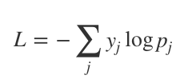

> 정답 벡터의 j번째 요소 y<sub>j</sub>, 소프트맥스의 j번째 출력값 p<sub>j</sub>


### 관련 미분 기초 공식

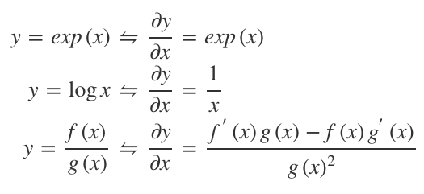


### 소프트맥스 함수의 그래디언트

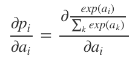

- p<sub>i</sub>, p<sub>j</sub> 에 대한 Softmax-with-Loss 계층의 i번째 입력값 a<sub>i</sub>의 그래디언트.

#### i = j인 경우 

exp(a<sub>i</sub>) 를 f, 분모 ∑<sub>k</sub>exp(a<sub>k</sub>) 를 g로 보고 위 미분공식을 활용해 다시 적으면

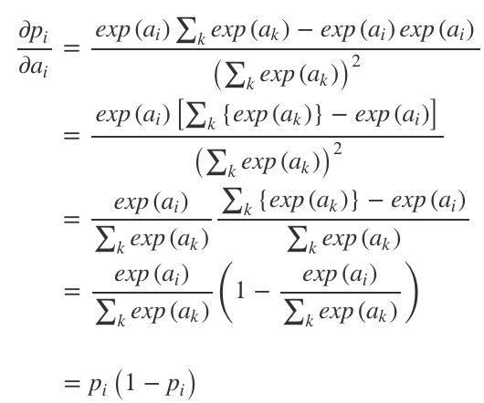

∑<sub>k</sub>exp(a<sub>k</sub>) 를 a<sub>i</sub>에 대해 편미분한 결과는 exp(a<sub>i</sub>)를 제외한 나머지 항은 상수 취급돼 소거됨

—> g'는 exp(a<sub>i</sub>)


#### i != j인 경우

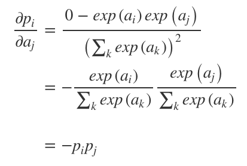

p<sub>i</sub> 는 분수형 함수이므로 분자 exp(a<sub>i</sub>)를 f, ∑<sub>k</sub>exp(a<sub>k</sub>) 를 g로 보고 미분공식을 활용해 적은 것.

그런데 exp(a<sub>i</sub>) 를 a<sub>j</sub> 에 대해 편미분하면 0이 되므로 f'g도 0이 됨.

 ∑<sub>k</sub>exp(a<sub>k</sub>)를 a<sub>j</sub> 에 대해 편미분한 결과는 exp(a<sub>j</sub>)를 제외한 나머지 항은 상수 취급돼 소거되므로 g'는 exp(a<sub>j</sub>)가 된다.

### 역전파

손실에 대한 Softmax-with-Loss 계층의 i번째 입력값 a<sub>i</sub>의 그래디언트는 다음과 같이 유도

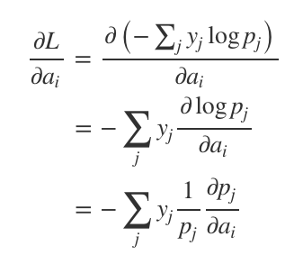

소프트맥스 함수의 그래디언트 (dp<sub>j</sub> / da<sub>i</sub>)는 i와 j가 같을 때와 다를 때 도출되는 값이 다름

—> 위 식의 시그마 부분에서 i번째 입력값에 해당하는 요소를 분리해 두 개의 항으로 표현

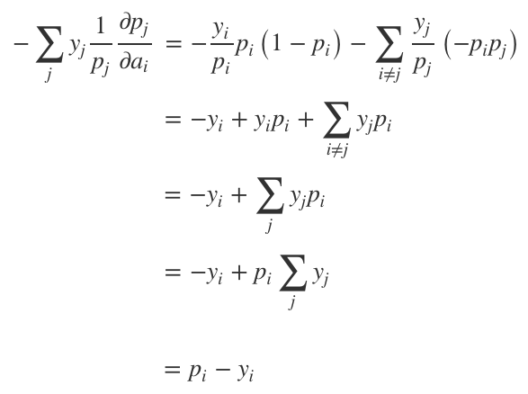

> 여기서 소프트맥스 확률의 합  ∑<sub>j</sub>y<sub>j</sub>는 1


### 그림으로 정리하기

- 신경망의 마지막단게의 계층으로 softmax 계층과 손실함수인 Cross Entropy Error 계층이 포함된 계층

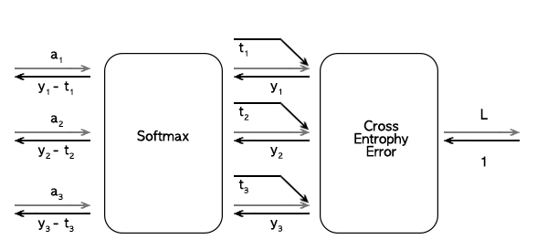


--------------
## **조민지**

## 순전파


1. 신경망을 통과해서 도달한 결과값은 오차를 포함한다.
2. 최종적으로 나온 오차는 여러 계산 과정들을 거치며 합산된 값이다.
3. 각 계산 과정마다 어느 정도의 오차가 발생했는지를 관찰해서 계산과정을 다시 수정해준다.
4. 즉, 오차가 많이 발생되게 한 요인들은 큰 폭으로 값을 변화시킨다.
5. 수치미분 대신 오차역전파 사용으로 효율을 좋게 한다. 


### 1. 계산그래프란?


- 계산과정을 그래프로 나타냄
- 노드와 에지로 표현


### 2. 국소적 계산이란?


- 노드에 직접 관계된 정보만으로 계산
- 노드입력(100,2)으로 출력(200) 생성
- 전체가 복잡해도 노드의 단순 계산에 집중 --> 문제 단순화 가능 
- 중간계산결과 보관
- 노드 하나하나의 미분의 효울적 계산 가능 


## 역전파


- 1* 1.1(소비세) = 1.1
- 1.1 * 2(사과개수) = 2.2
- 2.2는 입력값에 대한 결과에 대한 영향력의 값이다. 100에서 2.2만큼 영향을 받아 220이 된것이다.
- 2.2는 미분의 값이다. 기울기값이다. x쪽으로 1만큼 커졌을때 y가 얼마나 변화할까?의 대한 답이다.
- 2.2는 미분값이지만 실제로 우리는 미분을 사용하진 않았다. 단순한 곱셈으로 계산하였다.


### 1. 연쇄법칙


### 2. 덧셈노드의 역전파


- 그대로 전달


- 덧셈계층 코드 예시
```python
class AddLayer:
    def __init__(self):
        pass
    
    def forward(self,x,y):
        out = x+y
        return out
    
    def backward(self,dout):
        dx = dout*1
        dy = dout*1
        return dx,dy
```

### 3. 곱셈노드의 역전파


- x,y 값 바꿔서 계산


- 곱셈계층 코드 예시
```python
class MulLayer:
    def __init__(self):
        self.x=None
        self.y=None
        
    def forward(self, x, y):
        self.x =x
        self.y =y
        return x*y
    
    def backward(self, dout):
        dx = dout *self.y
        dy = dout *self.x
        return dx,dy
```


[사과가게 python 코드 예시](https://github.com/jominjimail/ausg/blob/master/ML/week7/forward_backward.ipynb)


### 4. 마지막에 나온 110, 2.2, 3.3, 165, 650 의 의미


- 단위 1 이 변경되었을때, 결과값에 미치는 영향력
- 사과의 개수가 2에서 3으로 증가하면 결과값이 715에서 825로 변경된다. 이 차이는 110 이다. 
- 사과의 가격이 100에서 101로 증가하면 결과값이 715에서 717.2로 변경된다. 이 차이는 2.2이다.
- 귤도 마찬가지이다. 


## 활성화 함수 계층 구현


### 1. ReLu 함수 구현


- 순전파에서 입력값이 0 이상인 경우는 들어온 값을 그대로 전달한다.
- 순전파에서 입력값이 0 이하인 경우는 0을 전달한다.
- 역전파에서 입력값이 0 이상인 경우는 들어온 값을 그대로 전달한다.
- 역전파에서 입력값이 0 이하인 경우는 0을 전달한다.


### 2. sigmoid 함수 구현

- 순전파


- 역전파


- 간소화


- 코드 구현
```python
import numpy as np
class Sigmoid:
    def __init__(self):
        self.out = None
    
    def forward(self, x):
        out = 1/(1+np.exp(-x))
        self.out = out
        return out
    
    def backward(self, dout):
        dx = dout*(1.0 - self.out)*self.out
        return dx
```


### 3. affine, sofrmax 함수 구현


> Affine 계층은 행렬 내적을 기하학에서 어파인 변환(affine transformation)이라고 하고, 어파인 변환을 수행하는 처리를 Affine 계층이라는 이름으로 만든다. 즉, 이전 계층의 모든 뉴런과 연결되어 있어 행렬의 내적(np.dot())을 사용하여 계산하는 계층/레이어를 Affine 계층/레이어라 부른다.
```python
import numpy as np
X = np.random.rand(2)
W = np.random.rand(2,3)
B = np.random.rand(3)
Y = np.dot(X,W) +B
```
 - 배치처리란? 입력값이 10000개라면 하나하나 언제 계산하고 있을까. 컴퓨터가 처리할 수 있는 정도의 양을 배열로 묶어서 한번에 처리하는게 배치처리라한다.
 - X(2) 에서 (N,2) 로 수정한다. N묶음을 한번에 처리하는것이다. (Batch)
 

 

 [affine python 코드 예시](https://github.com/jominjimail/ausg/blob/master/ML/week7/affine.ipynb)

### softmax-with-Loss 계층

- 추론: 가장 좋은 결과를 찾아 내는 것
- 학습: 앞의 변수들(W,B)을 수정해서 추론에서 나온 가장 높은 값을 크게하고 다른 값들은 작게 만드는 과정 (정답지, 라벨이 필요함)
> 예시 '2'라는 숫자를 데이터화해서 000000001100010010000010000100001000011110000000 을 input으로 넣는다. Affine -> ReLu -> Affile -> ReLu -> Affine -> Softmax 계층을 지난다. 여기서 마지막 Affine의 출력값이 각각 (5.3, 0.3, 10.1 ...) 이라고 하자 이 값은 추론시 사용되고 Softmax의 출력값 (0.008, 0.00005, 0.991 ...)은 학습시 사용된다. 즉, (5.3, 0.3, 10.1 ...)을 보고 10.1인 2의 점수가 가장 높기때문에 이 값은 '2'라고 추론을 할 수 있고, (0.008, 0.00005, 0.991 ...)을 보고 '2'일 확률이 99.1%이고, 0일 확률이 0.008%라는걸 알 수 있다. 이를 토대로 W,B를 조절해서 2일 확률을 높이고, 0일 확률을 낮추도록 학습시키는것이다. 단, 들어온 입력값이 '2'라는 사실을 알고 있어야한다.


 

- sofrmax 함수로 교차 엔트로피 오차를 사용하면 역전파가(y1-t1, y2-t2, y3-t3)로 간단해진다. 이렇게 계산 결과를 단순하고 쉽게 만들기 위해 설계된 것이 교차 엔트로피 오차이다.

- sofr max Cross Entropy Error 예시


입력값 (a1, a2, a3) 

순전파


역전파 


